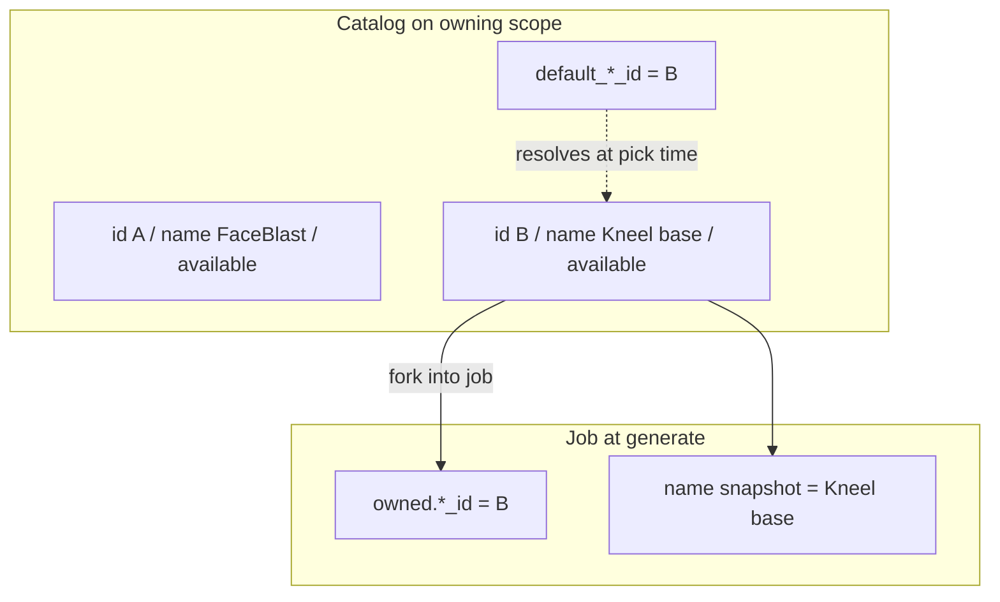

# Catalog identity (app-wide)

Contract for any **named set of configuration** this app catalogs: prompt variants,
stacks, clips, and future params/LoRA presets. Prompt-specific application:
[VARIANT_MANAGEMENT.md](./VARIANT_MANAGEMENT.md). Clip designation parallel:
[CLIP_SELECTION_MODEL.md](./CLIP_SELECTION_MODEL.md).

**Last updated:** 2026-09-24

---

## Four-part contract

| Concept | Role | Mutable? |
|---------|------|----------|
| Opaque id (`*_id`) | Identity. What jobs and lineage record. | No |
| `name` | Human label operators see and can rename. | Yes |
| `available` | Whether the entry appears in pickers / automated selectors. | Yes |
| Default designation | Pointer on the owning scope to one id. | Yes (pointer only) |

**Rules:**

1. Never use `"default"` as an entry’s only name. Default is a **designation**, not an identity.
2. Jobs record the **opaque id** plus a **name snapshot at run time** for display.
3. Renaming an entry or reassigning the default must not rewrite historical jobs.
4. Filename / slug / stem is storage or a hint — **not** semantic identity.

---

## When adding a new catalog

1. Mint a stable opaque id per entry (UUID or equivalent).
2. Require a distinct human `name` (never only `"default"`).
3. Add `available` (default `true`); filter pickers and automation on it.
4. Store default as a **pointer** on the owning scope (`default_*_id`), not as a reserved filename.
5. Stamp id + name snapshot onto the job (or equivalent runtime record) at generate/fork.
6. Promote / update writes **by id**; “make this the default” is a separate designation call.

---

## Adoption status

| Config set | Opaque id | Mutable name | `available` | Default designation | Job stamp |
|------------|-----------|--------------|-------------|---------------------|-----------|
| **Prompt variants** | `variant_id` (implementing) | `name` | `available` | `default_variant_id` in `prompt_catalog.json` | `job.prompt.variant_id` + `variant_name` |
| **Stacks** | `stack_id` (file stem) | partial | not yet | shape `stack:` default | `job.stack_id` |
| **Clips** | `clip_id` | yes | soft-delete / ★ | `default_clip_id` (legacy; ★ preferred) | `source_clip_id` |
| **Params / LoRAs** | single template today | — | — | — | adhoc / owned; adopt this contract when multi-entry |

Stacks and clips are **partial adopters** — align name/`available` when those surfaces gain full catalog management. Do not invent a second identity model.
