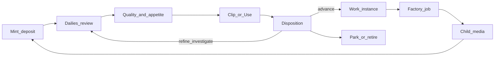

# Corpus lifecycle

**Status:** Model v0 (terminology + canonical picture + catalog/gaps). Not a UI build yet.

**Related:** [`ASSET_LIFECYCLE_PLAN.md`](./ASSET_LIFECYCLE_PLAN.md) (file custody), [`DISPOSITION_BUCKET_MODEL.md`](./DISPOSITION_BUCKET_MODEL.md) (day-to-day review/disposition), [`RATINGS_V1_PLAN.md`](./RATINGS_V1_PLAN.md) (quality vs appetite), [`HEURISTIC_ENGINE_NORTH_STAR.md`](./HEURISTIC_ENGINE_NORTH_STAR.md) (desire→technique / find+generate), [`PLANNING_OVERVIEW.md`](./PLANNING_OVERVIEW.md).

---

## 1. Two lifecycles (do not conflate)

| Term | Definition | Question |
|------|------------|----------|
| **Asset lifecycle** | Custody of a media object: register, present/missing, locate, relocate, stage, dedupe, companions, reference rewrite. | Where is it, and do pointers still work? |
| **Corpus lifecycle** | How a piece of media moves through **judgment and reuse** to grow a **variety** of related work — not toward a single deliverable. | What do we want from it next, and what has it already produced? |

Never use bare “lifecycle” in new writing without the qualifier.

**North star difference from film/post:** classical editorial funnels toward one cut / picture lock. This system is a **loop**. Discovery and variation are **peers** of “finding the right shot.” Selects are **fuel and guidance** for more generation, not the end of the story.

---

## 2. Canonical picture

This diagram **is** the process model. If a stage cannot be shown here, it is not yet part of the codified corpus lifecycle.

### Legend

| Node | Meaning | Film borrowing |
|------|---------|----------------|
| **Mint / deposit** | Media enters the corpus (`og/` / indexed output, or factory deposit) | New dailies land |
| **Dailies / review** | Human look in a batch or browse pass | Dailies |
| **Quality & appetite** | ★ = do more **OF** (select); appetite = do more **WITH** (direction) | Selects vs “go further” |
| **Clip / Use** | Editorial unit (named span) vs this job’s window | Clip on a reel; use in a sequence |
| **Disposition** | Committed editing intent (advance / refine / park / …) | Editorial decision |
| **Work instance** | One committed route into the factory (Extend / Vary / Derive, …) | Work order |
| **Factory job** | Shape-factory + Comfy execution | Facility run |
| **Child media** | New output re-enters at mint | Next generation of dailies |
| **Park / retire** | Exits from active loop (deferred or removed) | Archive / kill |

**Steering (not separate silos):** quality and appetite sit **on** the subject and inform disposition and what gets queued. They are not a second product beside the loop.

**Preferred subject:** **clip** (editorial unit). **Asset** = parent media. **Job** = execution. Surfaces may still be asset- or job-centric; the model prefers clip.

---

## 3. Organizing principles

1. **The picture is the spec.** Unifying visualization forces stage order and vocabulary.
2. **Loop, not funnel.** Success = coverage + guided variation, not one master.
3. **Selects fuel the loop.** High quality / high appetite media re-seed generation.
4. **Re-entry is first-class.** Every deposited child is a new mint on the same diagram.
5. **Asset lifecycle stays off this diagram.** Custody (paths, registry, locate/move) is orthogonal; join on `content_id` / relpath when needed.
6. **Hourly / automation** is a **production arm** that can mint jobs without a human dailies pass; it still produces children that should re-enter dailies. Show it as a side inlet to mint/job, not as a replacement for editorial judgment.

---

## 4. Map to existing records

| Stage | Records / stores (today) | Primary docs |
|-------|--------------------------|--------------|
| Mint / deposit | Files under `output/og` (etc.), discovery index, factory deposit sidecars | Discovery / factory |
| Dailies | Rate batch, `triage_index` | Disposition model §2–6 |
| Quality | XMP → `ratings_index` / ratings SQLite | Ratings v1 |
| Appetite | `appetite_index` / ratings store | Ratings v1; disposition §3 |
| Clip / Use | Clips in asset registry; `.trims.json`; job `vhs_window` / `source_clip_id` | Disposition §1; clips scripts |
| Disposition | `disposition_index`, catalog entries | Disposition model §7 |
| Work instance | `work_items_index` (Phase 2A) | Bucket Phase 2 |
| Factory job | `.data/shape_factory/jobs/**/*.job.json` | Factory / Workbench |
| Child | New output + lineage edges | Lineage sketch |
| Park / retire | Disposition entries | Disposition catalog |

Day-to-day review detail remains in [`DISPOSITION_BUCKET_MODEL.md`](./DISPOSITION_BUCKET_MODEL.md). This doc is the **umbrella** and the **one picture**.

---

## 5. Fragment inventory (UI / surfaces)

Nav chrome already suggests a pipeline order (Library · Clips · Factory · Rating · Submit · Workbench · Queue) but that is **app navigation**, not a per-media lifecycle view.

| Part | Route / surface | Loop stage(s) | Centricity | Fit vs picture |
|------|-----------------|---------------|------------|----------------|
| Home | `/` | Resume hint | mixed | Points at the loop; does not show one media’s state |
| Library | `/discovery` | Find / mint adjacency | asset | Search; not “where on the loop” |
| Clips | `/discovery/clips` | Clip / Use | clip | Strong editorial unit; queue-from-clip |
| Rating | `/discovery/rate` | Dailies, judge, optional disposition | asset/clip | Best dailies surface |
| Lineage panel | Discovery | Parent/child | asset | Edges only; weak re-entry cue |
| Factory map | `/discovery/factory-map` | Jobs / families | family/job | Coverage & recover; not corpus spine |
| Submit | `/submit` | Compose work → job | media + routes | Action room; little loop context |
| Workbench | `/workbench` | Job, Use/trim, retry | job | Status + bindings |
| Comfy Queue | `/comfy-queue` | Job executing | prompt | Live GPU only |
| Work items | APIs / Phase 2A | Work instance | asset→job | Middle node exists; not the clear UI spine |
| Hourly | Planner | Automated mint / job | recipe | Production arm off the human spine |
| Vision slices / tag judge | `/vision/*` | Offline understanding | asset | Parallel (P1); not corpus loop |

---

## 6. Gaps (what the picture reveals)

| Gap | Why it matters |
|-----|----------------|
| **No unifying visual** | Nothing shows *selected clip/asset → position on the loop + open work + children* as one composition |
| **Unit fight** | Clip is the north-star subject; many screens are still asset- or job-centric |
| **Dailies ↔ Advance handoff** | Rating, Submit, and Workbench are separate rooms; weak “you are here → next action on *this* media” |
| **Child re-entry** | Lineage shows edges; little that says “this child needs dailies because parent advanced” |
| **Selects as fuel** | ★ / appetite stored but not visualized as steering on the same picture as disposition/work |
| **Work instance clarity** | 2A index exists; not consistently the node between disposition and Workbench job |
| **Park/retire exits** | Modeled in disposition; not visible as exits on a shared diagram |
| **Hourly placement** | Automated mint needs an explicit place on (or beside) the picture so it does not feel like a second universe |

---

## 7. Visualization contract (later UI)

A unified corpus-lifecycle view for a **selected clip** (fallback: asset) should show, in **one composition**:

1. **Where you are** on the loop (current stage highlighted).
2. **Steering badges** — quality ★ and appetite (select vs direction).
3. **Editorial unit** — active/default clip marks; link to parent asset.
4. **Disposition** — primary entry (or none).
5. **Open work** — work instances and/or linked factory jobs (pending / live / failed).
6. **Children** — deposited descendants with a clear path back into dailies.
7. **Exits** — park / retire without leaving the picture.

Non-goals for that view: asset relocate UI, Comfy graph editing, full factory-map family management.

---

## 8. Non-goals (this model)

- Implementing the unified UI in this doc pass.
- Asset locate / relocate / input reorg ([`ASSET_LIFECYCLE_PLAN.md`](./ASSET_LIFECYCLE_PLAN.md)).
- Renaming APIs (`disposition`, work items, etc. stay; **corpus lifecycle** is the umbrella name).
- Replacing [`DISPOSITION_BUCKET_MODEL.md`](./DISPOSITION_BUCKET_MODEL.md) — that remains the review-session detail map.

---

## 9. Next sessions (suggested)

1. **Refine the picture** with real walkthroughs (pick one clip; walk Rating → Submit → Workbench → child).
2. **UI spike:** one composition that implements §7 for a deep-linked clip (even read-only).
3. Align Home / nav copy with corpus-lifecycle language once the visual exists.
