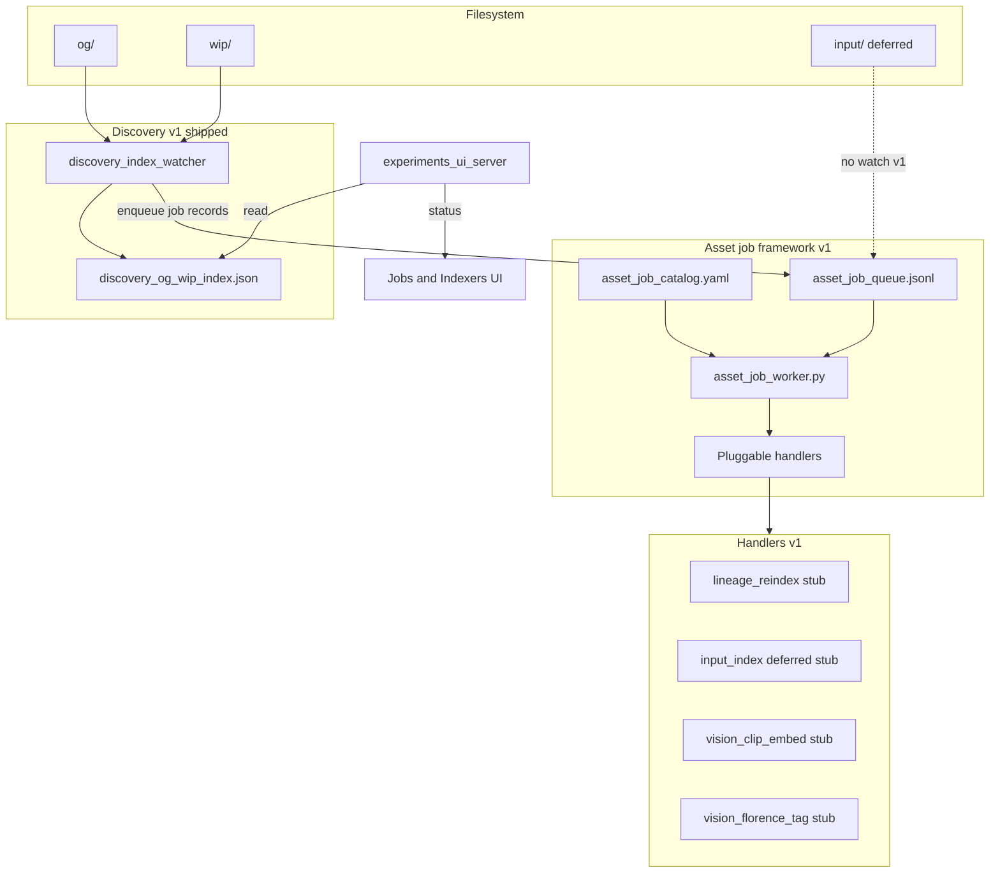

# Discovery index watcher + asset enrichment jobs — plan

**Status:** Planned — **not implemented** (saved 2026-07-09).

**Related:** [`DISCOVERY_SEARCH_AND_SIMILARITY_VISION.md`](./DISCOVERY_SEARCH_AND_SIMILARITY_VISION.md), [`LINEAGE_INDEX_SKETCH.md`](./LINEAGE_INDEX_SKETCH.md), [`RATINGS_V1_PLAN.md`](./RATINGS_V1_PLAN.md).

When implemented, operator docs should live in `docs/DISCOVERY_INDEX_WATCHER.md` (runbook; does not exist yet).

---

## Problem

Today [`scripts/experiments_ui_server.py`](../scripts/experiments_ui_server.py) only rescans `og/` and `wip/` on explicit `GET /api/discovery/library?refresh=1` (full `rglob` + PNG embed reads). There is **no filesystem listener**; UI auto-refresh is optional polling that triggers the same full scan.

Downstream work (lineage, vision tagging, similarity embeddings) must run on **independent schedules** and must **not** slow discovery reindexing.

### Interim: natural tip-in + ensure (shipped; watcher still end state)

Until this watcher lands, the Discovery index stays usable via:

| Path | When | What |
|------|------|------|
| **Tip-in** | `shape_factory deposit` (after durable outputs) | Best-effort upsert of each deposited `og/`/`wip` media stem into `discovery_og_wip_index.json` ([`discovery_index_upsert.py`](../workspace/scripts/discovery_index_upsert.py)) |
| **Ensure on miss** | `GET /api/discovery/asset-lineage` when seed missing | If the file exists under og/wip, upsert one stem group, invalidate cache, retry lineage |
| **Explicit ensure** | `POST /api/discovery/library/ensure` `{ relpath }` / `{ relpaths }` | Same upsert helper for callers that already know a path |

Hot path stays cheap (no full corpus `rglob`). Full `?refresh=1` remains for rebuild/reconcile. Tip-in + ensure are **safety nets** once the watcher exists (races, API-only hosts without the watcher process).

## Design principle: discovery fast, everything else queued

| Layer | v1 scope | Trigger | Output |
|-------|----------|---------|--------|
| **Discovery** | **Full implementation** | FS events on `og/` + `wip/` | `discovery_og_wip_index.json` |
| **Asset jobs** | **Framework + stubs** | Unified job queue fed by discovery changes | Per-job manifests under `_status/enrichment/` (later) |

**Hard rule:** discovery watcher only updates the discovery index and **appends job records** to a shared queue. No lineage inference, no CLIP/Florence, no GPU work inline.



---

## Goals (v1)

### Discovery (real)
- Fresh `discovery_og_wip_index.json` within seconds of stable media changes.
- Incremental stem updates; debounce + stability gate; lock + reconcile.

### Asset job framework (mechanics + stubs)
- **One queue format** and **one worker dispatcher** extensible to new job types.
- **Job catalog** (YAML) declares each job: schedule hint, batch size, resource class (`cpu` | `gpu`), `status` (`active` | `stub` | `deferred`).
- v1 handlers registered but **stubbed** — log `would_run`, update per-job state; **no** heavy compute.
- Lay groundwork for **vision enrichment** (CLIP embeddings, Florence captioning/tagging) without implementing models in v1.

### Lineage & input (as job types, not special cases)
- `lineage_reindex` — stub handler; independent drain rate; phase 2 writes `discovery_lineage_edges.json`.
- `input_index` — `deferred` in catalog; no FS watch until input reorg.

### Vision jobs (catalog + stub only v1)
- `vision_clip_embed` — future: image/frame embeddings for similarity search.
- `vision_florence_tag` — future: caption + structured tags for browse/filter.
- Optional placeholders: `vision_ocr`, `vision_aesthetic_score` (catalog only, `status: planned`).

### UI
- Indexers strip: discovery live/cached.
- **Enrichment jobs** panel: per job type — queue depth, last run, status (`stub` / `deferred` / `planned`), link to docs.

## Non-goals (v1)

- Running CLIP, Florence, or any GPU model.
- Writing embedding/tag indexes to disk (define paths only).
- Input FS watch.
- Coupling any enrichment into discovery debounce.

---

## 1. Discovery watcher (full v1)

Core modules: [`workspace/scripts/discovery_index_lib.py`](../workspace/scripts/discovery_index_lib.py), [`scripts/discovery_index_watcher.py`](../scripts/discovery_index_watcher.py), og/wip only, watchdog + poll fallback.

### After each discovery apply — enqueue job records only

Append to **`output/_status/asset_job_queue.jsonl`** (unified queue):

```json
{
  "job_id": "ulid-or-hash",
  "job_type": "lineage_reindex",
  "ts": "2026-07-09T12:00:00Z",
  "reason": "discovery_stem_upsert",
  "asset": {
    "group_id": "og:stem:…",
    "relpath": "og/…/file.mp4",
    "thumb_relpath": "og/…/file.png",
    "library": "og",
    "sha256": "…",
    "has_embedded_prompt": true
  },
  "discovery_updated_at": "…",
  "idempotency_key": "lineage_reindex:og:stem:…:sha256prefix"
}
```

**Fan-out at enqueue time** based on [`workspace/asset_job_catalog.yaml`](../workspace/asset_job_catalog.yaml):

| `job_type` | Enqueued when | v1 catalog `status` |
|------------|---------------|---------------------|
| `lineage_reindex` | every stem upsert/remove | `stub` |
| `vision_clip_embed` | image/png or video with thumb | `stub` |
| `vision_florence_tag` | same eligibility as CLIP (configurable) | `stub` |
| `input_index` | **never** from discovery v1 | `deferred` |

**Do not** enqueue GPU jobs when catalog marks them `deferred` or `planned` (optional dev flag `ASSET_JOB_ENQUEUE_STUBS=1` to test queue plumbing).

---

## 2. Asset job framework (shared infrastructure)

### Catalog: `workspace/asset_job_catalog.yaml`

```yaml
version: 1
jobs:
  lineage_reindex:
    status: stub
    resource: cpu
    interval_sec: 60
    batch: 10
    output: discovery_lineage_edges.json

  input_index:
    status: deferred
    reason: input_fs_reorg_pending
    resource: cpu

  vision_clip_embed:
    status: stub
    resource: gpu
    interval_sec: 300
    batch: 4
    output_dir: enrichment/clip_embeddings/
    model_pin: openclip-vit-b-32

  vision_florence_tag:
    status: stub
    resource: gpu
    interval_sec: 300
    batch: 2
    output_dir: enrichment/florence_tags/
    model_pin: florence-2-base
```

### Library: `workspace/scripts/asset_job_lib.py`

| Primitive | Purpose |
|-----------|---------|
| `enqueue_job(queue_path, record)` | Append JSONL |
| `read_batch(queue_path, state, job_types, limit)` | Cursor + dedupe by `idempotency_key` |
| `commit_cursor(state_path, offset)` | At-least-once safe drain |
| `job_state_path(job_type)` | `output/_status/enrichment/<job_type>_state.json` |
| `result_manifest_path(job_type, group_id)` | Future: per-asset result sidecar |

**Idempotency:** `idempotency_key = f"{job_type}:{group_id}:{content_hash_prefix}"`.

### Worker: `scripts/asset_job_worker.py`

- Dispatcher filters by `--job-types` (CPU vs GPU workers later).
- Per-type rate limits from catalog.
- Handler registry: `lineage_reindex`, `input_index`, `vision_clip_embed`, `vision_florence_tag`.
- v1: `run_stub` when `status == stub`; skip `deferred`/`planned`.

### Result layout (groundwork, empty in v1)

```
output/_status/enrichment/
  clip_embeddings/<group_id>.json
  florence_tags/<group_id>.json
  lineage_reindex/
```

### Vision jobs (phase 3)

| Job | Input | Output | Scheduling |
|-----|-------|--------|------------|
| `vision_clip_embed` | thumb PNG or sparse video frames | float vector + model version | GPU worker, batch 4 |
| `vision_florence_tag` | same | caption + tag list | GPU worker, serial or shared queue |
| Future | rating sampler `vision_gaps` | enqueue missing tags only | Router reads sampler output |

---

## 3. Lineage & input as job types

- **`lineage_reindex` (stub v1):** drain at catalog rate; no edge writes until phase F.
- **`input_index` (deferred v1):** skipped until input FS reorg; manual dev enqueue only.

---

## 4. API and UI

- `GET /api/discovery/indexers/status` — discovery watcher + per-job-type queue/state.
- Optional: `GET /api/discovery/jobs/catalog`, `POST /api/discovery/jobs/drain` (dev).
- UI: discovery live/cached + enrichment jobs table (lineage, input, CLIP, Florence statuses).

---

## 5. Files under `output/_status/`

| File | Writer | Reader |
|------|--------|--------|
| `discovery_og_wip_index.json` | discovery watcher, `refresh=1`, tip-in/ensure | API, handlers |
| `discovery_og_wip_index.json.lock` | discovery writers | writers wait |
| `discovery_watcher_state.json` | discovery watcher | API |
| `asset_job_queue.jsonl` | discovery watcher | asset_job_worker |
| `asset_job_worker_state.json` | worker | API |
| `enrichment/<job_type>_state.json` | per-type handler | API |
| `enrichment/<job_type>/<group_id>.json` | handlers phase 2+ | API, search |

---

## 6. Deployment (when implemented)

| Service | v1 | Notes |
|---------|-----|-------|
| `discovery_watcher` | on | CPU; og/wip watch + enqueue |
| `asset_job_worker` | on (stub) | `--job-types lineage_reindex,input_index` |
| `asset_job_worker_gpu` | off | Future: vision job types |

---

## Phased delivery

| Phase | Deliverable |
|-------|-------------|
| **A** | `discovery_index_lib.py` + tests |
| **B** | Discovery watcher + `asset_job_queue.jsonl` enqueue |
| **C** | `asset_job_catalog.yaml` + `asset_job_lib.py` + `asset_job_worker.py` + stub handlers |
| **D** | API `indexers/status` + jobs UI panel |
| **E** | Compose + runbook (`DISCOVERY_INDEX_WATCHER.md`) |
| **F (later)** | `lineage_reindex` active |
| **G (later)** | Input FS watch after reorg |
| **H (later)** | CLIP + Florence active; GPU worker |

## Implementation checklist

- [ ] Extract `discovery_index_lib.py`; server uses it for full build
- [ ] `test_discovery_index_lib.py`
- [ ] `discovery_index_watcher.py` + poll fallback
- [x] `asset_job_catalog.yaml` + `asset_job_lib.py` + `asset_job_worker.py` (phase C stubs)
- [x] Stub handlers (lineage, vision_clip, vision_florence, vision_slice_caption); `input_index` deferred
- [ ] `GET /api/discovery/indexers/status` + UI enrichment panel
- [ ] docker-compose services + `.env.example`
- [ ] `docs/DISCOVERY_INDEX_WATCHER.md` runbook

## Success criteria (v1)

- Discovery hot path: index only + cheap enqueue; no GPU, no lineage API.
- New job types addable via catalog + handler.
- UI shows correct stub/deferred labels for lineage, input, CLIP, Florence.
- Queue idempotency prevents duplicate stub work.

## Risks

| Risk | Mitigation |
|------|------------|
| Queue growth from vision fan-out | Catalog eligibility; compaction in phase 2 |
| GPU starvation of ComfyUI | Separate GPU worker; idle-only schedule |
| WSL bind-mount missed events | `DISCOVERY_WATCHER_MODE=auto` → poll fallback + daily reconcile |
| Schema churn | `job_id`, `model_pin`, catalog `version` on result manifests |
