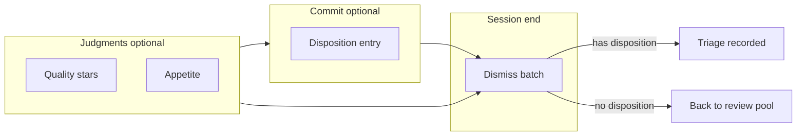
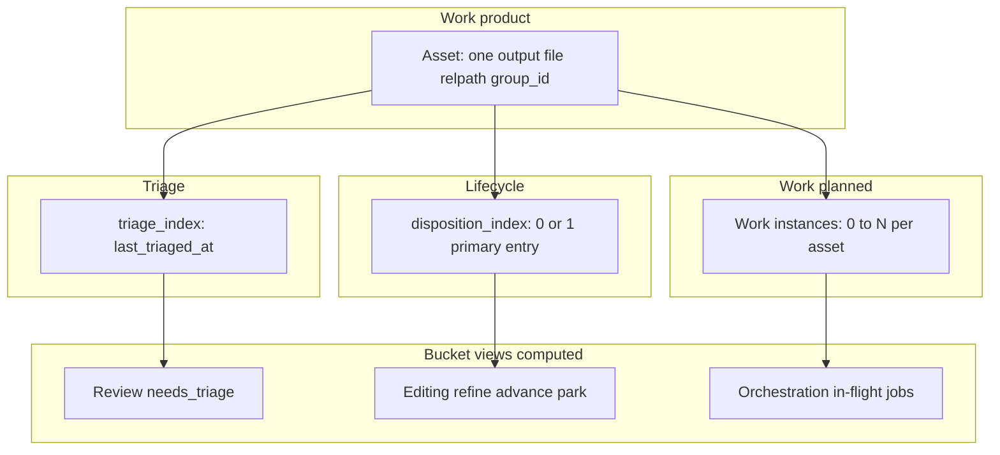
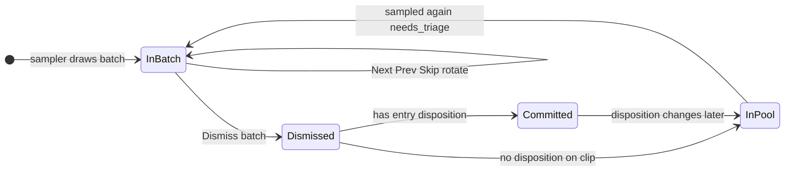
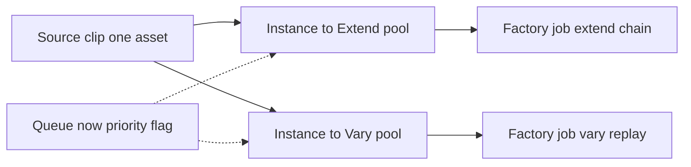
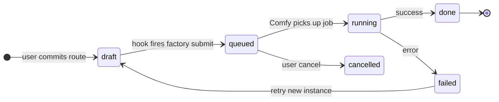
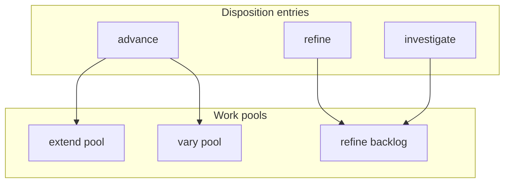
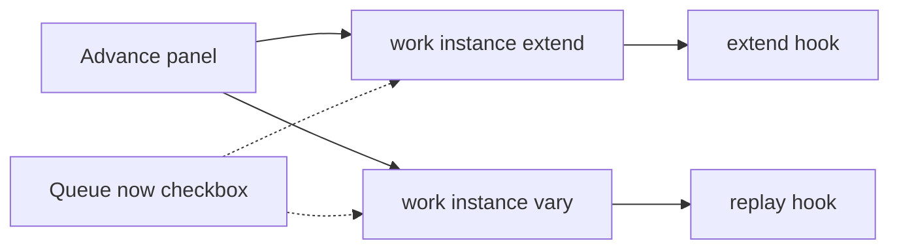
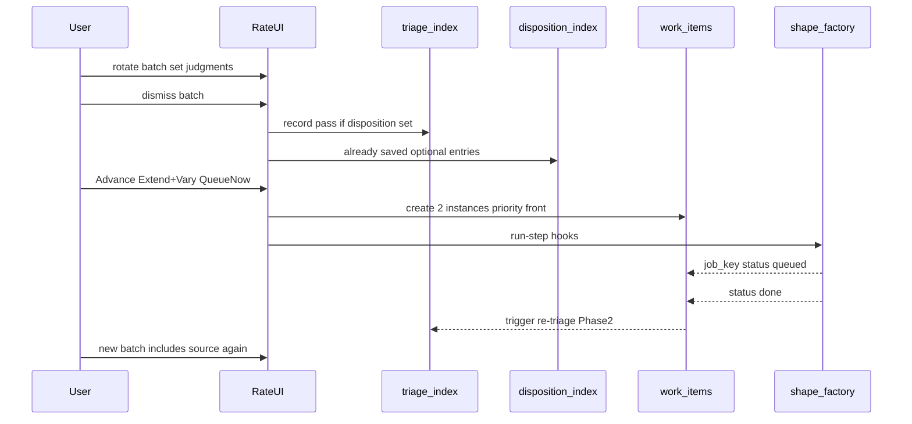

# Disposition, buckets, and review — model reference

**Last updated:** 2026-07-09

A skimmable map of the day-to-day process for reviewing clips, committing work intent, and feeding the factory — not a schema dump or API reference. For implementation detail see [RATINGS_V1_PLAN.md](./RATINGS_V1_PLAN.md).

---

## 1. Why this exists

ComfyUI output is broad and messy by design. The goal is **discovery**: generate a lot, index what happened, surface keepers, and commit only the work that matters.

This document names the **implicit process** you already use in a review session so software can stay out of the way. It is a mental model, not a mandate to build every box on the diagram.

**Anti-goals:** full API listing, over-engineered orchestration, or pretending every planned feature is shipped.

---

## 2. Day in the life

A typical review session on `/discovery/rate`:

1. **Open rate queue** — the sampler draws a **fixed batch** of clips that need triage.
2. **Rotate** through the batch (Next / Prev / Skip). For each clip you may set ★ quality, appetite, and optionally a **disposition** entry. Nothing is final until you dismiss the batch.
3. **Revisit** clips in the same batch as many times as you need — ratings and disposition can change while you work.
4. **Dismiss batch** when you feel done with this pass.
5. **Outcomes:**
   - Clips **with** an entry disposition → triage committed; they leave the review pool until disposition changes or a child output appears.
   - Clips **without** disposition → return to the undisposed pool for a future batch.
6. **Later (planned):** clips marked **Advance** may fan out into multiple **work instances** (Extend pool, Vary pool) with optional **Queue now** priority.

---

## 3. Judgment axes

Four related concepts; do not conflate them.

| Axis | Question | Store | Required during batch? |
|------|----------|-------|------------------------|
| **Quality ★** | How well executed? | XMP → `ratings_index.json` | No |
| **Appetite** | Want more in this direction? | `appetite_index.json` | No |
| **Disposition** | What work is committed next? | `disposition_index.json` | No |
| **Triage** | Have I finished review for this pass? | `triage_index.json` | Recorded on **dismiss batch** (only if disposition set) |

**Triage ≠ disposition.** Finishing a batch with **no disposition** on a clip is normal — it means “no committed editing work right now,” not “undecided forever.”



---

## 4. Four layers

Buckets are **mostly views** over these layers — not folders you move files into.



| Layer | Mutable? | Cardinality per asset |
|-------|----------|------------------------|
| Asset | File on disk; lineage links versions | 1 file |
| Triage pass | Recorded timestamp; re-triage opens new pass | 0–1 active “needs review” |
| Disposition | Yes — set, change, clear | 1 primary **entry** at a time |
| Work instance | Yes — queue, run, complete, retry | 0–N |
| Bucket view | Computed query | Many views at once |

---

## 5. Bucket types

Three lenses you will use repeatedly. Same clip can appear in more than one **view** at the same time.

| Bucket type | Question it answers | Example |
|-------------|---------------------|---------|
| **Review** | Does this need a human look? | `needs_triage` — never triaged, or disposition changed since last triage |
| **Editing** | What kind of work is committed? | disposition = refine, advance, park, retire, … |
| **Orchestration** | What is running or queued? | open factory jobs linked to source clip |

Review is a **phase**, not a disposition marker. Editing buckets map to **disposition entries**. Orchestration buckets map to **work instances** (planned index; today: factory job files).

---

## 6. Review batch flow

The batch is a **stable working set** until you dismiss it.



**Rules:**

- **Next / Prev / Skip** only navigate inside the batch — they do **not** record triage or remove clips from the batch.
- **Dismiss batch** calls `POST /api/discovery/asset-triage/complete-batch` for every clip in the batch; the server **commits triage only** for clips with an entry disposition.
- Clips without disposition are unchanged in `triage_index` and stay eligible for future review batches.
- **Re-triage:** a clip re-enters the review pool when `disposition_updated_at > last_triaged_at` (disposition changed after last committed triage).

---

## 7. Disposition entries (editing buckets)

One **primary entry** at a time per asset (mutually exclusive). Steps (e.g. refine.quality) are actions under an entry.

| Entry | Meaning | Typical steps |
|-------|---------|---------------|
| **Refine** | Known delta — fix artifact | Aspect, Quality, Edit |
| **Investigate** | Unknown delta — route elsewhere | Salvage, pipeline, fix, retire |
| **Advance** | Feed next pipeline stage | Extend, Vary (+ priority) |
| **Extract** | Salvage part of clip | Frame, clip, reference |
| **Re-evaluate later** (park) | Deferred — committed “come back” | (none) |
| **Retire** | Remove from active work | Trash, Archive |

Catalog source: [`disposition_catalog.yaml`](../disposition_catalog.yaml).

Disposition is **mutable**: refine → advance → cleared → park is all valid over the asset’s life.

---

## 8. Advance: pools vs priority

Under **Advance**, the same source clip can spawn **multiple work instances** — not multiple copies of the file, but multiple rows of committed work.



| Concept | Role | Pool? |
|---------|------|-------|
| **Extend** | Chain this output into the video slot for a longer run | Yes — Extend pool |
| **Vary** | Replay with variation (often queue front) | Yes — Vary pool |
| **Queue now** | Run urgently / at front of queue | **No** — priority on an instance |

Example: one keeper → instance A (Extend, normal priority) + instance B (Vary, **Queue now**). Two pools, one optional priority flag each.

**Today’s UI:** Advance router still presents Extend / Vary / Queue now as a single-choice “next step” menu. The model above is **planned**; work-item index and multi-route UI are not shipped yet.

---

## 9. Multi-bucket FAQ

**Can one video be in multiple buckets at once?**  
Yes as **views** (e.g. “Advance disposition” + “has open factory job”). No as conflicting **lifecycle** (only one primary disposition entry).

**Is bucket state on the asset, the bucket, or the instance?**  
Split: disposition on asset; work on **instances**; buckets are **queries**.

**Same workproduct, same pool, two instances?**  
Yes for work (e.g. two Vary attempts). No for duplicate review slots in one batch.

**When is a clip reviewed again?**  
Never triaged; disposition changed after last triage; (planned) work completed or new child output; explicit re-evaluate.

**No disposition after dismiss — what does that mean?**  
“You looked; no editing work committed.” Clip returns to the undisposed pool.

---

## 10. Shipped vs planned

| Capability | Status |
|------------|--------|
| Quality ★ + appetite on rate page | Shipped |
| Disposition entries + step hooks (v1) | Shipped |
| Triage index + dismiss batch | Shipped |
| Fixed batch rotation (Next ≠ triage) | Shipped |
| Re-triage on disposition change | Shipped |
| Work item index (`work_items_index.json`) | **Phase 2** — see [BUCKET_MODEL_PHASE2_PLAN.md](./BUCKET_MODEL_PHASE2_PLAN.md) |
| Advance multi-route UI (pool toggles) | **Phase 2** |
| Queue now as priority flag (not a pool) | **Phase 2** |
| Dedicated pool pages (`/discovery/pools/*`) | **Phase 2** |
| Re-triage on work complete / child output | **Phase 2** |
| Pool query spec (`pool_views.yaml`) | **Phase 2** |
| Orchestration bucket (work ↔ factory join) | **Phase 2** |

---

## 11. Work instances (planned layer detail)

A **work instance** is one committed route from a source asset to the factory — not a duplicate file.



| Field | Meaning |
|-------|---------|
| `work_id` | Stable row id (ULID) |
| `source_relpath` / `source_group_id` | Keeper clip this work extends from |
| `pool` | `extend` \| `vary` \| `refine` \| … (destination family) |
| `priority` | `normal` \| `front` (Queue now) |
| `factory_job_key` | Link to shape_factory job when known |
| `child_relpaths` | Outputs produced (filled on completion) |
| `status` | `draft` → `queued` → `running` → `done` \| `failed` |

**Cardinality:** one asset → **many** instances (e.g. Extend + Vary at once; or a second Vary retry after failure). Dedupe is per `(pool, recipe, cooldown)` — not “one job per clip ever.”

**Store:** `work_items_index.json` under `output/_status/` (planned). Today orchestration visibility is inferred from factory jobs only.

---

## 12. Pool catalog

Pools are **where work instances go**, not disposition entries.

| Pool | Disposition entry | Typical factory action |
|------|-------------------|-------------------------|
| **extend** | Advance | Chain output into video slot; longer run |
| **vary** | Advance | Replay / variation; often front-queue |
| **refine_backlog** | Refine, Investigate | Replay, trim, regen hooks |
| **extract** | Extract | Frame/grab reference (lighter weight) |
| **orchestration** | (view only) | All non-terminal work items |

**Queue now** is **not** a pool — it sets `priority: front` on one or more instances in extend/vary/refine pools.



---

## 13. Bucket view queries (formal)

Bucket pages and the sampler share **computed queries** — nothing is “moved into” a bucket folder.

### Review bucket

```
needs_triage(asset) :=
  is_video(asset)
  AND NOT disposition.entry == retire
  AND (
    NOT exists(triage_index[asset])
    OR disposition.updated_at > triage_index.last_triaged_at     -- Phase 1 shipped
    OR work_terminal_since_last_triage(asset)                   -- Phase 2
    OR new_child_since_last_triage(asset)                       -- Phase 2
    OR manual_re_triage_requested(asset)                        -- Phase 2
  )
```

### Editing buckets (by disposition entry)

```
refine_backlog(asset) := disposition.entry IN (refine, investigate)
park_bucket(asset)      := disposition.entry == park
retired(asset)          := disposition.entry == retire
advance_intent(asset)   := disposition.entry == advance
```

### Orchestration bucket

```
orchestration(asset) :=
  EXISTS work_item WHERE work_item.source == asset
    AND work_item.status IN (draft, queued, running)
```

### Pool pages (Phase 2)

```
extend_pool(work) := work.pool == extend AND work.status IN (draft, queued, running)
vary_pool(work)   := work.pool == vary   AND work.status IN (draft, queued, running)
```

Declarative spec planned in `workspace/pool_views.yaml` — see [BUCKET_MODEL_PHASE2_PLAN.md](./BUCKET_MODEL_PHASE2_PLAN.md).

---

## 14. Advance UI (planned)

**Today:** single-choice step menu (Extend **or** Vary **or** Queue now).

**Target:**

1. User sets disposition entry **Advance**.
2. Checkboxes: **Extend** | **Vary** (both allowed).
3. Optional **Queue now** applies `priority: front` to checked routes.
4. On commit → one **work instance** per checked pool → hooks fire (or instances stay `draft` until dismiss batch — product choice in Phase 2; default: fire on commit).



---

## 15. Re-triage triggers (full matrix)

| Trigger | Phase | Effect |
|---------|-------|--------|
| Never triaged | 1 shipped | In review pool |
| Disposition changed after `last_triaged_at` | 1 shipped | In review pool |
| Dismiss batch without disposition | 1 shipped | Stays out until trigger fires |
| Work item reaches `done` or `failed` | 2 planned | Source asset back in review pool |
| New child output (lineage edge) | 2 planned | **Child** needs first triage; parent optional |
| User clicks “Review again” | 2 planned | Force `needs_triage` until next dismiss |
| Retire disposition | 1 shipped | Excluded from review regardless |

**During an active batch:** changing disposition does **not** immediately re-queue — only **dismiss batch** commits triage for disposed clips.

---

## 16. End-to-end lifecycle (expanded)



---

## 17. Glossary

| Term | Definition |
|------|------------|
| **Asset** | One output file (e.g. `og/.../clip.mp4`) plus `group_id` / lineage identity |
| **Triage pass** | A review session outcome recorded in `triage_index.json` |
| **Disposition** | Optional, mutable editing intent on an asset |
| **Work instance** | One committed route (pool + priority) → factory job |
| **Bucket view** | Computed list (review, editing, orchestration) — not a stored folder |
| **Pool** | Destination for work instances (Extend, Vary, Refine backlog, …) |
| **Priority** | Scheduling hint (Queue now = front / urgent) — not a pool |
| **Batch dismiss** | End review batch; commit triage for disposed clips only |

---

## See also

- [RATINGS_V1_PLAN.md](./RATINGS_V1_PLAN.md) — implementation plan, APIs, indexes
- [BUCKET_MODEL_PHASE2_PLAN.md](./BUCKET_MODEL_PHASE2_PLAN.md) — work items, pool pages, multi-route Advance (planned)
- [DISCOVERY_SEARCH_AND_SIMILARITY_VISION.md](./DISCOVERY_SEARCH_AND_SIMILARITY_VISION.md) — browse and similarity
- [`disposition_catalog.yaml`](../disposition_catalog.yaml) — entry markers and hooks
