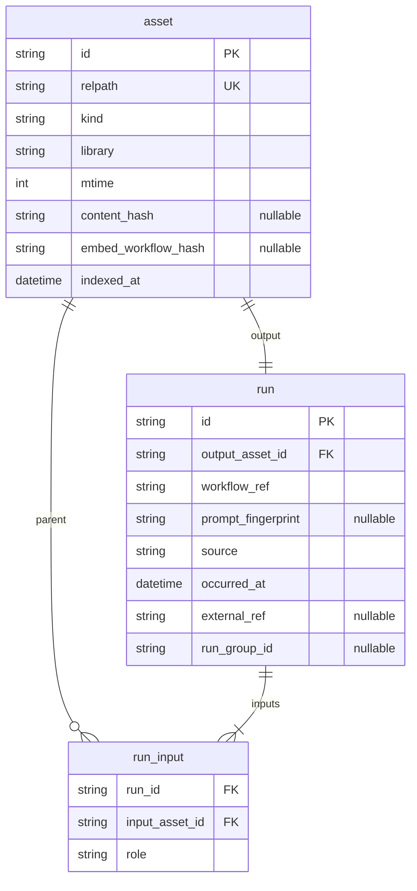

# Lineage index — design sketch (v0)

This document sketches a **durable, queryable index** for artifact **lineage** (and related exploration) on top of the existing idea that **MP4/PNG are the primary handles** for workflows. It is a design target, not a committed implementation.

## Goals

- **Fast answers** to: “What did this output come from?” (ancestors), “What did it lead to?” (descendants), “What workflow snapshot was used for this step?”
- **Canonical media on disk** (and embedded metadata) remain **source of truth**; the index is **derived** and **rebuildable**
- **Incremental maintenance** as new files land (no full rescan of the world on every click)
- A base for **richer graph views** (landscape, faceted browse) as a **projection** of the same store

## Non-goals (v0)

- Perfect provenance when a file was produced **outside** the instrumented pipeline
- Storing full workflow JSON in the DB (store **pointers** and **hashes**; load from embed or file on demand)
- Real-time sync with Comfy’s internal history (integrate at your **queue** / **output** boundary)

## Core abstractions

### 1. `asset` (node)

A **concrete file** the system can point at (library-relative or workspace-relative path, plus optional **content hash** for identity across renames).

| Field (conceptual) | Notes |
|--------------------|--------|
| `id` | Stable internal id (ULID or rowid) |
| `relpath` | Primary key for *human* use; normalize as you do in Discovery today |
| `kind` | `image` \| `video` \| `other` |
| `library` | e.g. `og` \| `wip` (if applicable) |
| `mtime` / `size` | For invalidation and “file changed” |
| `content_hash` | Optional; best for durable identity |
| `embed_workflow_hash` | Optional; hash of prompt JSON if read from PNG (for “same recipe” queries) |
| `indexed_at` | When this row was last confirmed |

### 2. `run` (edge / event)

One **generating act**: one or more **inputs** + one **primary output** (or several outputs in v1 with a `run_id` grouping). This is the bridge between “lineage” and “rerun from here.”

| Field (conceptual) | Notes |
|--------------------|--------|
| `id` | |
| `output_asset_id` | The child artifact you care about for “this step” |
| `workflow_ref` | **Pointer only**: e.g. `embed:from_output` (use child’s embed), or `path:...`, or `parent_output:...` |
| `prompt_fingerprint` | Hash of API-format prompt if you have it (for dedup and “same run” detection) |
| `source` | `queue` \| `import` \| `inferred` (provenance quality) |
| `occurred_at` | From mtime, exif, or queue log |
| `external_ref` | Optional: experiment id, `prompt_id`, `submit.json` path |

**v0 simplification:** one **output** per `run` row; multiple outputs = multiple `run` rows sharing a `run_group_id` (optional column).

### 3. `run_input` (many-to-one to `run`)

| Field | Notes |
|-------|--------|
| `run_id` | |
| `input_asset_id` | Parent / starter media |
| `role` | `primary_video` \| `starter_image` \| `mask` \| `reference` \| `unknown` |

Edges in the lineage graph: **input_asset → output_asset** via `run`.

### 4. Optional: `workflow_snapshot` (dedup layer)

Only if you want many runs to share identical graphs without re-storing URIs everywhere.

| Field | Notes |
|-------|--------|
| `prompt_hash` | PK |
| `source_asset_id` | Asset whose embed defined this snapshot (exemplar) |
| `created_at` | |

Otherwise **omit** this table initially and resolve workflow by **walking to an exemplar asset** that still has an embed.

## Entity relationship (v0)

## Where data is ingested (incremental)

1. **Discovery / library refresh** (you already scan `og`/`wip`): upsert `asset` rows; update `mtime`/`size`; optional **content hash** in background jobs
2. **When a queue run completes** (best signal): insert `run` + `run_input` from known parents + output path (your scripts already touch `submit.json`, queue managers, etc.)
3. **Backfill pass** (batch): walk indexed assets; read PNG workflow embed or sidecar if you add one; infer **single-parent** lineage when metadata exists

**Rule:** Index rows carry `source = inferred` when you guessed from embeds; `queue` when you observed the run.

## Query patterns (for UI)

| Question | Query shape |
|----------|-------------|
| Lineage **up** (starters) | Recursive CTE from `asset` → `run_input` → parent `asset` until no parents |
| Lineage **down** | From `asset` find `run` where it appears in `run_input`; follow `output_asset_id` |
| Jump to step *k* | Same as navigating to that `asset` id or `relpath` |
| “Same workflow” cluster | Group by `prompt_fingerprint` or `embed_workflow_hash` |

SQLite handles recursive CTEs well; **Postgres** same. Start with **single-file SQLite** (`output/_status/lineage_index.sqlite` or similar) for operational simplicity on the pod.

## Discovery side panel — tab model (UI-first proposal)

You prefer driving design from the UI. One way to align **parameter control**, **asset work**, and **workflow-as-exemplar work** without forcing a single primary metaphor:

| Tab (working names) | Role |
|---------------------|------|
| **Parameters** | Today’s **Comfy** tab: load embedded prompt, quick edits, submit to queue, front-of-queue, status. *The “run this graph with these knobs” surface.* |
| **Assets** | **Activity family:** find, filter, group, and organize **images and video** in context of the current item and library (saved, recents, same folder, same day, etc.). Can start as a **narrow, contextual** strip and grow into richer browser; the full-page **Library** can remain the wide canvas while the panel offers *per-item* and *cross-item* asset tools. |
| **Workflows** | **Activity family:** discover and compare **workflows as stored in / on assets** (PNG/MP4 exemplars, embedded prompts, fingerprints). Not a separate filesystem tree—**same artifacts**, different affordances: “same recipe”, open exemplar, pin workflow for compare, lineage stubs when the index exists. |

**Details** (existing tab): keep **metadata about the selected Discovery row** (title, paths, trim, saved, etc.) separate from these three so the drawer does not mix “what is this file?” with “what do I want to do?”

### Principles for this shell

- **Situational primacy:** No tab is “the” main mode; **Parameters** is default for *run* intent, **Assets** / **Workflows** for *explore* intent—you can flip without leaving the selection.
- **Workflows ≠ new store:** The **Workflows** tab is a **lens** on workflow-carrying media, matching *artifacts as defacto workflow stores* until a template DB exists.
- **Phone / narrow width:** Tab count grows; consider a **segmented control + overflow**, or merging **Assets** entry points into **Parameters** footer until breakpoints allow—implementation will reveal constraints.

### Early exploration (before heavy backend)

- **Parameters:** already present; rename/label only if it helps users.
- **Assets:** light v0 = filters + links that **deep-link** into existing Library behavior (scroll to, highlight) + saved-only toggle mirroring main list.
- **Workflows:** light v0 = “open embed source”, workflow path copy, placeholder for **future** fingerprint grouping + lineage list.

This panel structure is compatible with the **lineage index** later: **Workflows** and **Assets** become consumers of the same DB projections (ancestors, clusters by `prompt_fingerprint`).

## Invalidation / caching

- **Per-asset**: if `mtime`/`size` changed since `indexed_at`, re-read metadata and optionally re-link (or mark `dirty` for async worker)
- **Full rebuild**: delete DB and replay ingestion (always possible if artifacts remain)

## Visualization “landscape” (later projections)

Same tables support:

- **Timeline** (sorted `occurred_at` per branch)
- **Bipartite** graph: assets on one partition, runs on the other (common for Graphviz / Gephi exports)
- **Facet panels**: “all outputs from this `prompt_fingerprint`” without new storage

## Implementation phasing (suggested)

| Phase | Scope |
|-------|--------|
| **0** | Document only (this file); agree on path + minimal columns |
| **1** | SQLite file + ingest from **existing discovery index** (assets only); no edges yet |
| **2** | Hook **one** queue completion path to write `run` + `run_input` |
| **3** | Lineage panel: ancestors query + “open this asset/workflow” |
| **4** | Backfill inferred edges from PNG embeds where possible |

## Relation to current repo

- **Discovery** today builds `discovery_og_wip_index.json` — good **asset list** feed for Phase 1 ingest
- **Experiments / queue scripts** — natural place to emit **authoritative** `run` rows (Phase 2)

## Open decisions

- **Identity**: path-only v0 vs hash-backed when stable enough
- **Multi-parent** runs: explicit in `run_input` from day one (recommended) even if UI is linear first
- **DB location**: co-locate under `workspace/output/.../_status/` with discovery index for a single backup story

---

*Revision: introductory sketch for discussion; tighten when implementing Phase 1.*
