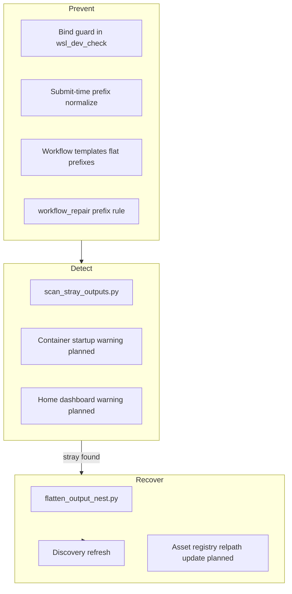

# Output path mitigation strategy

**Last updated:** 2026-07-09

ComfyUI output can land in the **wrong place** in two independent ways. This doc is the operational strategy: prevent, detect, recover — and when to run each tool.

---

## Two failure modes (do not conflate)

| Mode | Symptom | Example |
|------|---------|---------|
| **A. Wrong bind mount** | Files under repo `workspace/output`, E: shadow, or empty tree while “real” data is elsewhere | `.env` missing → compose defaults to `./workspace/output` |
| **B. Nested prefix drift** | Files under `<bind>/output/og/...` instead of `<bind>/og/...` | Workflow `filename_prefix` = `output/og/...` while Comfy save root is already `/ComfyUI/output` |

**Canonical layout** (from [`CURRENT_GOAL.md`](./CURRENT_GOAL.md)):

```text
COMFYUI_BIND_OUTPUT_DIR=/home/yuji/comfyui-runpod-data/output
  ├── og/
  ├── wip/
  ├── experiments/
  └── _status/
```

**Not canonical:**

```text
<bind>/output/og/...          # nested (mode B)
repo/workspace/output/...     # bind trap (mode A)
/mnt/e/comfyui-runpod-shadow/workspace/output/...  # legacy host (mode A)
```

Discovery, rate queue, and shape_factory defaults assume **flat** `og/` under the bind root. Stray writes are often **invisible** in daily UI until someone notices missing clips.

---

## Layered defense



**Principle:** nothing is “moved into a bucket” at write time — we **normalize paths before submit**, **scan after sessions**, and **flatten idempotently** when drift happens anyway.

---

## Shipped today

| Tool | Layer | What it does |
|------|-------|----------------|
| [`workspace/scripts/output_path_lib.py`](../workspace/scripts/output_path_lib.py) | Prevent | `flatten_output_prefix()` — `output/output/og/...` → `og/...` |
| [`workspace/scripts/comfyui_submit.py`](../workspace/scripts/comfyui_submit.py) | Prevent | Normalizes `filename_prefix` on factory + experiment queue submit |
| [`workspace/scripts/watch_queue.py`](../workspace/scripts/watch_queue.py) | Prevent | Same normalization on watch-queue submit |
| [`scripts/wsl_dev_check.sh`](../scripts/wsl_dev_check.sh) | Prevent + detect | Fails on repo-trap bind; runs 48h stray scan |
| [`scripts/scan_stray_outputs.py`](../scripts/scan_stray_outputs.py) | Detect | Recent media in nested / legacy roots |
| [`scripts/flatten_output_nest.py`](../scripts/flatten_output_nest.py) | Recover | Moves `<bind>/output/{og,wip,experiments,_status}` → flat |
| [`workspace/scripts/workflow_repair.py`](../workspace/scripts/workflow_repair.py) | Prevent | UI + prompt repair rules for nested `filename_prefix` |
| [`scripts/audit_workflow_output_prefixes.py`](../scripts/audit_workflow_output_prefixes.py) | Prevent | Audit/fix saved ComfyUI workflow JSON |

**Runtime tolerance (not prevention):** `experiments_ui_server._prefer_flat_library_dir()` reads flat or nested — helps browse but **does not** fix rate-queue sampling or indexes tuned to flat paths.

---

## Operational cadence

### Before starting a session

```bash
./scripts/wsl_dev_check.sh
```

Fix any `ERROR:` on `COMFYUI_BIND_OUTPUT_DIR` before `npm run up`.

### After a batch of runs (or next morning)

```bash
python3 scripts/scan_stray_outputs.py --since-hours 48
```

Exit code **0** = clean. **1** = strays found → recover below.

### After workflow edits (or quarterly)

```bash
python3 scripts/audit_workflow_output_prefixes.py          # preview
python3 scripts/audit_workflow_output_prefixes.py --apply  # fix saved workflows
```

Fixes nested `output/og` prefixes in ComfyUI workflow JSON (manual canvas runs). Files owned by `root` (container saves) may need `sudo chown` before `--apply` can write them.

### Recover strays

```bash
# Preview
python3 scripts/flatten_output_nest.py \
  --bind-root "$(grep ^COMFYUI_BIND_OUTPUT_DIR= .env | cut -d= -f2-)"

# Apply
python3 scripts/flatten_output_nest.py \
  --bind-root "$(grep ^COMFYUI_BIND_OUTPUT_DIR= .env | cut -d= -f2-)" --apply
```

Then refresh Discovery: `/discovery?refresh=1`.

**Non-media conflicts** (e.g. `crash_ledger.jsonl` in both trees): merge or backup-append unique lines, delete nested copy, re-run flatten. See flatten report under `output/_status/flatten_output_nest_report_*.json`.

---

## Gaps and planned mitigations

Ranked by ROI.

### P0 — Close the manual-run hole

| Item | Status |
|------|--------|
| **Workflow repair rule** — strip `output/` before `og\|wip\|experiments` on Save / VHS nodes | **Shipped** — `FlattenLibraryOutputPrefixRule` + prompt rule in `workflow_repair.py` |
| **Template audit** — `scripts/audit_workflow_output_prefixes.py` | **Shipped** — scan/fix saved workflows |
| **shape_factory / snowflake_factory** — flat prefixes on generated workflows + API prompt sanitize | **Shipped** |

### P1 — Make drift visible without remembering to scan

| Item | Why |
|------|-----|
| **Entrypoint banner** — log warning if `<bind>/output/og` has media mtime &lt; 24h | Catches drift at container boot |
| **Home dashboard card** — stray count from `scan_stray_outputs` API | Surfaces problem in UI you already open |
| **Hourly hook** — `shape_factory_hourly` or ops sidecar runs scan, writes `output/_status/stray_output_scan.json` | Passive monitoring |

### P2 — Structural hardening

| Item | Why |
|------|-----|
| **Repo trap removal** — symlink or README + `chmod` guard on `workspace/output` | Stops mode A when compose falls back |
| **Canonical marker** — `output/_status/canonical_bind.json` with expected path + layout version | Machines and scripts agree on “home” |
| **Asset registry** — update `current_relpath` after flatten | Phase 2 asset lifecycle; content-id survives moves |
| **Discovery FS watcher** — index both roots during transition, then drop nested | See [`DISCOVERY_INDEX_WATCHER_PLAN.md`](./DISCOVERY_INDEX_WATCHER_PLAN.md) |

### Not now

- Blocking Comfy submit at runtime when prefix looks nested (too brittle for one-off experiments)
- Auto-flatten without dry-run review (risky for crash ledgers / partial writes)

---

## Decision matrix

| Situation | Action |
|-----------|--------|
| Clips missing from Discovery / rate queue | `scan_stray_outputs` → `flatten_output_nest --apply` → Discovery refresh |
| Files under `repo/workspace/output` | Fix `.env` bind; rsync to canonical bind; remove repo copies after verify |
| Files on E: shadow | Migrate per `migrate_comfy_bind_data_to_linux.sh`; update `.env` |
| Only queue/factory runs drift | Prefix normalize already shipped — audit workflow templates for manual runs |
| Repeated nightly drift | Implement P0 workflow repair + P1 entrypoint/dashboard |

---

## Prefix rules (for authors)

When Comfy save directory is `/ComfyUI/output` (bind root):

| Write this | Not this |
|------------|----------|
| `og/2026-07-09/family/job` | `output/og/2026-07-09/...` |
| `wip/my_clip` | `output/wip/...` |
| `experiments/exp_id/run` | `output/experiments/...` |

Exception: paths outside library tops (`output/custom/...`) are left unchanged by normalize — avoid using `output/` as a custom folder name.

---

## Related docs

- [`CURRENT_GOAL.md`](./CURRENT_GOAL.md) — canonical bind paths
- [`ASSET_LIFECYCLE_PLAN.md`](./ASSET_LIFECYCLE_PLAN.md) — registry + relocation (long-term)
- [`DISCOVERY_INDEX_WATCHER_PLAN.md`](./DISCOVERY_INDEX_WATCHER_PLAN.md) — live index updates
- [`WORKFLOW_REPAIR_PLAN.md`](./WORKFLOW_REPAIR_PLAN.md) — repair tiers (add prefix rule here)

---

## Verification checklist

After any mitigation change:

1. `python3 -m pytest workspace/tests/test_output_path_lib.py` (or inline checks)
2. Submit a test job — inspect prompt JSON `filename_prefix` starts with `og/` not `output/og/`
3. `scan_stray_outputs --since-hours 1` after test run → 0 strays
4. Discovery refresh shows new clip under flat path
