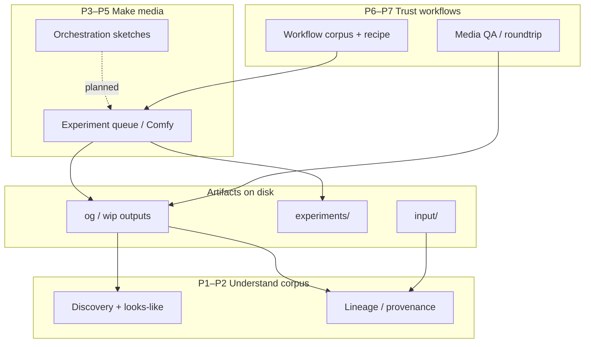

# Planning overview — corraling related work

This document **organizes** scattered design notes, running systems, and sketches into **coherent programs**. It does not replace detailed specs; it is the map you return to after exploratory dives.

**Browse (read / search / print):** `./scripts/serve_planning_docs.sh` → [http://127.0.0.1:8000](http://127.0.0.1:8000) — MkDocs Material site over `docs/`. Use browser Print on any page; bucket model PDF: `./scripts/build_bucket_model_pdf.sh`.

**How to use it**

| Mode | What you do |
|------|-------------|
| **Explore** | Follow curiosity; add bullets to a program’s *Notes & emergence* or open a new sketch doc. Chaos is allowed. |
| **Corral** | When something repeats or blocks you, **name it**, assign it to **one program**, set **one next action**. |
| **Execute** | Pick **at most one primary spike** and **one maintenance lane** per week; everything else stays parked. |

**Personal north star (design):** learn where models are **transformative** vs **noise**; build a **human-led corpus** with **classical search** for daily discovery and **batch AI** for analysis, tagging, and occasional retrain. See [`DISCOVERY_SEARCH_AND_SIMILARITY_VISION.md`](./DISCOVERY_SEARCH_AND_SIMILARITY_VISION.md).

---

## System map (how pieces touch)

**Shared foundations:** paths under `workspace/output/`, embedded PNG/MP4 metadata, `experiments_ui_server.py`, Docker ops profile, GPU time.

---

## Programs (coherent plans)

Each program has: **intent**, **today**, **next** (actionable), **later**, **key docs**, **not now**.

---

### P1 — Discovery & similarity (“looks / reads like”)

**Intent:** Find and describe work by **perceptual and language** similarity; optional **in-timeline** slices; grow a **tagging corpus** without live LLM for daily browse.

| | |
|--|--|
| **Today** | Discovery library (og/wip), path search, lineage UI, workflow facets, trim/health; `asset_tags` bootstrap + editorial `source_facets`; **no** CLIP/Florence index |
| **Next (spike)** | **V2** — watcher + job-queue stubs that enqueue the same portable slice caption/tag scripts (V1 kept time slices) — [`DISCOVERY_INDEX_WATCHER_PLAN.md`](./DISCOVERY_INDEX_WATCHER_PLAN.md) |
| **Later (locked sequence)** | **V3a** PromptGen-large tags into `asset_tags`/facets (pin: `_status/vision_v3a_tag_pin.json`; informed base∪large later) → **V4** BM25/sidecar search → **V3b** CLIP/ANN and **V5** HITL as recall demands |
| **Docs** | [`DISCOVERY_SEARCH_AND_SIMILARITY_VISION.md`](./DISCOVERY_SEARCH_AND_SIMILARITY_VISION.md) (V1–V5 sequence), [`VISION_V1_TIME_SLICE_CAPTION_SPIKE.md`](./VISION_V1_TIME_SLICE_CAPTION_SPIKE.md), [`SOURCE_FACET_SIMILARITY_PLAN.md`](./SOURCE_FACET_SIMILARITY_PLAN.md), [`DISCOVERY_INDEX_WATCHER_PLAN.md`](./DISCOVERY_INDEX_WATCHER_PLAN.md), [`SCALE_INDEX_ARCHITECTURE.md`](./SCALE_INDEX_ARCHITECTURE.md) (job_output + ratings hot path + vector join rules) |
| **Not now** | Temporal NL (“X then Y”); full LoRA; face-embedding identity provider |

**GPU:** batch worker **off** interactive Comfy.

---

### P2 — Lineage & provenance (“where did this come from?”)

**Intent:** Durable **causal graph** (parents, runs, inputs) — orthogonal to similarity; meets Discovery at the **selected asset**.

| | |
|--|--|
| **Today** | Prompt-path inference, `discovery_lineage_edges.json`, API + UI, `backfill_discovery_lineage.py`; **`job_output_index.sqlite`** for output→job joins ([`SCALE_INDEX_ARCHITECTURE.md`](./SCALE_INDEX_ARCHITECTURE.md)) |
| **Next (spike)** | **Inferred ratings v1** — lineage-backed rollup to workflows/sources/recipes; see [`RATINGS_V1_PLAN.md`](./RATINGS_V1_PLAN.md) |
| **Later** | Phase-1 `asset`/`run` store; **promotion** of referenced externals; T2I/T2V text roots; lineage-aware search; multi-hop inference |
| **Docs** | [`LINEAGE_INDEX_SKETCH.md`](./LINEAGE_INDEX_SKETCH.md), [`RATINGS_V1_PLAN.md`](./RATINGS_V1_PLAN.md), [`SCALE_INDEX_ARCHITECTURE.md`](./SCALE_INDEX_ARCHITECTURE.md) |
| **Not now** | Replacing similarity with graph traversal |

---

### P3 — Experiment pipeline & queue (“keep runs flowing”)

**Intent:** Reliable **tune experiments** → Comfy submit → status → recovery.

| | |
|--|--|
| **Today** | `watch_queue.py`, ops containers, ledger, `status.json`, Experiments UI `/api/queue` |
| **Next** | Ops hygiene (disable duplicate Windows tasks if Docker ops on); ledger tuning only if pain |
| **Later** | Tighter integration with durable `run` rows (P2) |
| **Docs** | [`SCHEDULED_AND_CONTAINER_JOBS_RUNDOWN.md`](./SCHEDULED_AND_CONTAINER_JOBS_RUNDOWN.md) |
| **Not now** | Multi-step orchestration execution |

---

### P4 — Generation UX (“act on an artifact from the UI”)

**Intent:** From a visible output, **replay / extend / tune** without fighting the canvas.

| | |
|--|--|
| **Today** | Discovery player, Comfy quick edits, embed-api-prompt, queue submit |
| **Next (MVP)** | **Resubmit / replay / extend** — liberal template pairing, fail-fast, logging (`WORKSPACE_PROJECTS_RUNDOWN` §4.1) |
| **Later** | WIP tune launcher; **load workflow on Comfy canvas** from Discovery; seed surfing; intermediate editor |
| **Docs** | [`WORKSPACE_PROJECTS_RUNDOWN.md`](./WORKSPACE_PROJECTS_RUNDOWN.md) §4.1; `workspace/experiments_ui/docs/FEATURE_WIP_TUNE_LAUNCHER.md`; [`PROJECT_ORGANIZATION_PROPOSAL.md`](./PROJECT_ORGANIZATION_PROPOSAL.md) §9–10 |
| **Not now** | Full workflow compatibility matrix |

---

### P5 — Orchestration (“planned multi-step work”)

**Intent:** Define **pipelines** across buckets/collections and eventually **execute** them with durable step state.

| | |
|--|--|
| **Today** | Orchestrator JSON UI (projects/pipelines/queues — **planning**); Factory SQLite (buckets, run_plans, planned_jobs — **planner**) |
| **Next** | **Nothing required** unless resubmit MVP proves need for collections; keep capturing plans in Orchestrator/Factory |
| **Later** | Runner: planned_jobs → Comfy submit; A→B→C; workflow profiles / validation |
| **Docs** | Vision doc § “Related: job runners…”; [`WORKSPACE_PROJECTS_RUNDOWN.md`](./WORKSPACE_PROJECTS_RUNDOWN.md) §4.1 |
| **Not now** | Auto-executing `OrchestratorPipeline` steps |

---

### P6 — Workflow corpus & recipe (“cooked like” + maintenance)

**Intent:** Understand **what workflow shapes exist**, keep them **valid** after upgrades, support **recipe similarity** later.

| | |
|--|--|
| **Today** | Fingerprints in discovery index; `snowflake_inventory.py` spike; node rename tooling; shape_factory `graph_hash` on jobs |
| **Next** | **Ratings v1** aggregates by `graph_hash` + factory recipe — [`RATINGS_V1_PLAN.md`](./RATINGS_V1_PLAN.md) Phase 1 |
| **Later** | Recipe clusters in search; cached workflow profiles for queue validation; hourly/best pick by `rating_effective` |
| **Docs** | [`WORKFLOW_COMPATIBILITY.md`](./WORKFLOW_COMPATIBILITY.md); [`RATINGS_V1_PLAN.md`](./RATINGS_V1_PLAN.md); vision doc “cooked like”; `workspace/scripts/snowflake_inventory.py` |
| **Not now** | Full litegraph similarity product |

---

### P7 — Media QA & reproducibility

**Intent:** Trust that **WIP/output** matches workflow intent (roundtrip, agreement checks).

| | |
|--|--|
| **Today** | `process_wip_dir`, `check_roundtrip_dir`, integration test + fixtures |
| **Next** | Only when a specific workflow family regresses |
| **Later** | CI gate on representative fixtures |
| **Docs** | `workspace/tests/fixtures/media/README.md`, `workspace/README.md` |

---

### P8 — Image content sorter (parallel CLIP path)

**Intent:** **Still-image** libraries sorted by visual similarity (WIP dumps, general sets) — separate from **video slices**.

| | |
|--|--|
| **Today** | `workflows/image_sorting_tools/` developed |
| **Next** | Use when still sort pain ≠ video Discovery pain |
| **Later** | Optional merge with P1 embeddings policy |
| **Docs** | `PROJECT_ORGANIZATION_PROPOSAL.md` Project C; `IMAGE_SORTER_GUIDE.md` |

---

### P9 — Platform, infra & integrations

**Intent:** Run Comfy + pipeline **reproducibly**; optional RunPod, GPU layout, Krita bridge, repo boundaries.

| | |
|--|--|
| **Today** | Docker compose, RunPod doc, GPU guides, Krita optional env, check-in strategy |
| **Next** | Batch vision **only via portable V1 runners** (local idle / Docker / optional RunPod); tear down paid pods when done |
| **Later** | Submodule split per organization proposal |
| **Docs** | [`DOCUMENTATION.md`](../DOCUMENTATION.md), `RUNPOD.md`, [`CHECKIN_STRATEGY.md`](./CHECKIN_STRATEGY.md), [`PROJECT_ORGANIZATION_PROPOSAL.md`](./PROJECT_ORGANIZATION_PROPOSAL.md), [`KRITA_AI_SETUP.md`](./KRITA_AI_SETUP.md) |

---

## Cross-cutting rules (decisions that span programs)

1. **One GPU consumer** for heavy forwards unless you explicitly time-share (Comfy vs batch tagging).
2. **Artifacts are truth** on disk; indexes (Discovery, lineage, slices) are **derived and rebuildable**.
3. **Three lenses stay separate:** provenance (P2), looks-like (P1), recipe (P6) — UI may join at one asset.
4. **Labels are versioned judgments** — taxonomy drift is normal (refinement passes, not shame).
5. **Exploration → corral:** if an idea survives two sessions, it gets a program home and a *next* line here.

---

## Suggested focus (right now)

Avoid parallel spikes across programs. Locked sequence for P1 vision:

| Slot | Program | Action |
|------|---------|--------|
| **Primary spike** | **P1 / V2** | Watcher + job-queue stubs for portable slice caption/tag jobs — [`DISCOVERY_INDEX_WATCHER_PLAN.md`](./DISCOVERY_INDEX_WATCHER_PLAN.md) |
| **Background** | **P3** | Keep queue/ledger healthy; no new architecture |
| **Pinned (P1)** | V3a prep | Day-one tagger = PromptGen-large (`vision_v3a_tag_pin.json`); informed base∪large later |
| **Parked (P1)** | V3b–V5 | Until V2 stubs + first V3a tag writes exist |
| **Parked** | P4–P6 | Until slice-aware jobs can feed Discovery |
| **Note-only** | P2, P5, P7–P9 | Capture pain in *Notes*; no build |

---

## Notes & emergence (parking lot)

_Use this section during mental exploration. Promote bullets into a program’s **Next** when they stabilize._

- **V1 retrospective (2026-07-16): Keep time slices.** Offline 2s windows + whole-video A/B and the Vision slices review UI were enough to keep span-aware captions/tags on the path (index span rows later; V2 should enqueue the same portable scripts). Separately, blind tag judgment (48 samples) pinned **PromptGen-large** as the V3a day-one tagger; **base∪large** (or an informed union: large always, add base-only when ★/prior-good and not FP-blocked) stays deferred. Artifacts: `_status/vision_tag_judgments.ndjson`, `vision_v3a_tag_pin.json`.

---
## Doc index (quick links)

| Topic | Document |
|-------|----------|
| Planning hub | **this file** |
| Discovery / similarity / HITL / LLM posture | [`DISCOVERY_SEARCH_AND_SIMILARITY_VISION.md`](./DISCOVERY_SEARCH_AND_SIMILARITY_VISION.md) |
| P1 V1 time-slice caption spike (impl) | [`VISION_V1_TIME_SLICE_CAPTION_SPIKE.md`](./VISION_V1_TIME_SLICE_CAPTION_SPIKE.md) |
| Discovery FS watcher + enrichment jobs (planned) | [`DISCOVERY_INDEX_WATCHER_PLAN.md`](./DISCOVERY_INDEX_WATCHER_PLAN.md) |
| Lineage DB sketch | [`LINEAGE_INDEX_SKETCH.md`](./LINEAGE_INDEX_SKETCH.md) |
| Bucket model Phase 2 (work items, pools) | [`BUCKET_MODEL_PHASE2_PLAN.md`](./BUCKET_MODEL_PHASE2_PLAN.md) |
| Output path drift (prevent / detect / recover) | [`OUTPUT_PATH_MITIGATION.md`](./OUTPUT_PATH_MITIGATION.md) |
| Queue & containers | [`SCHEDULED_AND_CONTAINER_JOBS_RUNDOWN.md`](./SCHEDULED_AND_CONTAINER_JOBS_RUNDOWN.md) |
| Workspace projects & resubmit MVP | [`WORKSPACE_PROJECTS_RUNDOWN.md`](./WORKSPACE_PROJECTS_RUNDOWN.md) |
| Repo split proposal | [`PROJECT_ORGANIZATION_PROPOSAL.md`](./PROJECT_ORGANIZATION_PROPOSAL.md) |
| Workflow node upgrades | [`WORKFLOW_COMPATIBILITY.md`](./WORKFLOW_COMPATIBILITY.md) |
| All docs entry | [`DOCUMENTATION.md`](../DOCUMENTATION.md) |

---

*Treat this file as living: after each spike retrospective, update **Today / Next / Not now** for affected programs only.*
