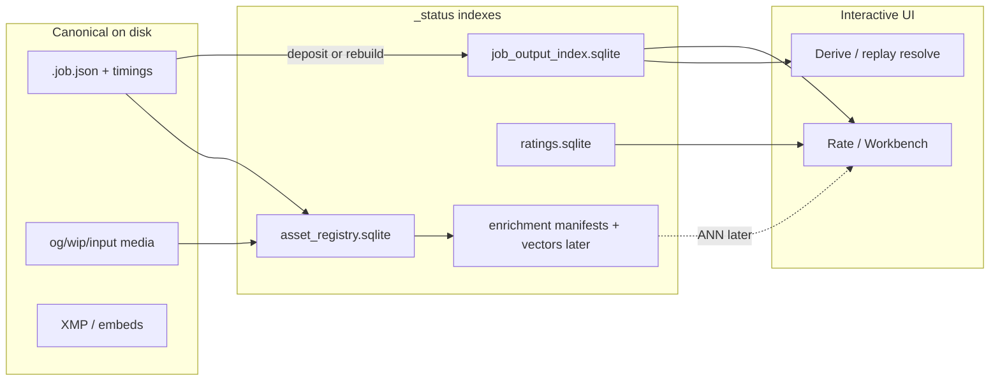

# Scale-ready indexes (jobs, ratings, vision)

**Status:** Active — Phase A documented; Phases B–C shipping in code.

**Related:** [`PLANNING_OVERVIEW.md`](./PLANNING_OVERVIEW.md), [`DISCOVERY_INDEX_WATCHER_PLAN.md`](./DISCOVERY_INDEX_WATCHER_PLAN.md), [`ASSET_LIFECYCLE_PLAN.md`](./ASSET_LIFECYCLE_PLAN.md), [`DISCOVERY_SEARCH_AND_SIMILARITY_VISION.md`](./DISCOVERY_SEARCH_AND_SIMILARITY_VISION.md), [`LINEAGE_INDEX_SKETCH.md`](./LINEAGE_INDEX_SKETCH.md).

---

## North star

- **Canonical truth stays on disk**: `.job.json` / sidecars, media, XMP, vision NDJSON.
- **Indexes are derived and rebuildable** under `output/_status/`.
- **Join key for media identity**: prefer `content_id` ([`asset_registry.sqlite`](../workspace/scripts/asset_registry.py)); path/relpath are secondary.
- **GPU / vision never blocks interactive paths** (watcher rule).



## Target stores (do not merge everything into one DB)

| Store | Role | Not for |
|-------|------|---------|
| **`job_output_index.sqlite`** | Fast `output_relpath` / basename / `content_id` → `job_key` + construction summary | Full job JSON |
| **`ratings.sqlite`** | Live quality/appetite rows | Job construction, vectors |
| **`asset_registry.sqlite`** | Stable `content_id` ↔ current path + refs | Heavy construction blobs |
| **`enrichment/`** (planned) | Captions, tags, CLIP vectors, facet providers | Interactive Comfy/UI latency budget |

### Default paths

| Artifact | Path |
|----------|------|
| Job output index | `<og>/../_status/job_output_index.sqlite` (i.e. `output/_status/`) |
| Ratings live store | `output/_status/ratings.sqlite` |
| Asset registry | `output/_status/asset_registry.sqlite` |
| Enrichment root (later) | `output/_status/enrichment/` |

### `job_output_index` row shape (v1)

- Keys: `output_relpath`, `output_basename`, `content_id` (nullable until hashed), `job_key`
- Construction summary: `pick_mode`, `family_slug`, `frames_before`, `generation_frames`, `output_frame_count`, `overlap`, `fps`, `parent_output`, `graph_hash`
- Pointers: `job_path`, `updated_at`
- Unique: `(job_key, output_relpath)`; lookup indexes on basename, content_id, relpath

## Write triggers

| Event | Action |
|-------|--------|
| **Deposit** (`shape_factory deposit` / pipeline deposit) | `upsert_from_job` for each deposited video |
| **Rebuild CLI** | `python3 shape_factory.py job-output-index rebuild` — scan `.job.json` once |
| **Star / appetite click** | SQLite upsert (+ XMP for quality). **Must not**: full job-tree scan, `_enrich_row_sources` / ffprobe, rewrite multi-MB aggregate JSON |
| **Vision / CLIP** | Offline enrichment jobs only; never inline in Experiments UI request handlers |

## Rebuild commands

```bash
cd workspace/scripts
PYTHONPATH=. python3 shape_factory.py job-output-index rebuild
# optional: --data-root /path/to/.data --og-root /path/to/output/og

python3 shape_factory.py ratings build   # refresh ratings.sqlite + ratings_index.json aggregates
```

## Interactive path rules (star-click)

**Allowed:** open `ratings.sqlite`, upsert one row, write/clear XMP, return compact JSON.

**Forbidden on the click path:**

- `build_job_output_index` / `rglob("*.job.json")`
- `extract_prompt_media` / ffprobe source enrichment (belongs on `ratings build`)
- Atomic rewrite of full `ratings_index.json` / `appetite_index.json`
- Loading CLIP / Florence / ANN

GET `/api/discovery/asset-ratings` should prefer SQLite `by_output` + cached aggregate sections from JSON (mtime of the JSON file), not re-parse the export on every SQLite write.

## Consumers of `job_output_index`

| Consumer | Before | After |
|----------|--------|-------|
| Replay / fast_track resolve | Live full job scan | `lookup_by_relpath` |
| Rate scrubber `extension_range` | Basename → `find_job_by_key` | Index lookup → extension_range fields |
| Miss | — | Optional single `find_job_by_key` fallback; **never** full-tree scan per request |

## Phase D — Vision / vector readiness (`content_id` joins)

Enrichment and ANN must key off **`content_id`**, not invent a third identity:

1. Enrichment jobs write under `_status/enrichment/<content_id>/…` (or NDJSON rows with `content_id`), with optional `relpath` cache for humans.
2. Facets/tags continue through `source_facets` / `asset_tags` or enrichment tables — same hold-axis cohort API, better fillers (P1 V3a).
3. Vectors live in a **separate** ANN store (sqlite-vec / FAISS / external). **Do not** put float blobs in `job_output_index` or `ratings.sqlite`.
4. “More like this” query shape: `content_id` → neighbor ids → resolve paths via `asset_registry` → factory eligibility / construction via `job_output_index`.

Stub until V2/V3b: document only; no vector tables in Phase B/C.

## Explicit non-goals

- Replacing `.job.json` with a job DB of record
- Full lineage SQLite rewrite (P2 sketch until this pattern proves out)
- Face identity embeds
- CLIP vectors in ratings or job indexes

## Success criteria

- No full job-tree scan on rate load, star click, or replay resolve
- Rate scrubber bands resolve via indexed construction fields for deposited jobs
- Star click does not run source enrich / ffprobe
- Vision/vector work joins `content_id` instead of a third identity scheme
