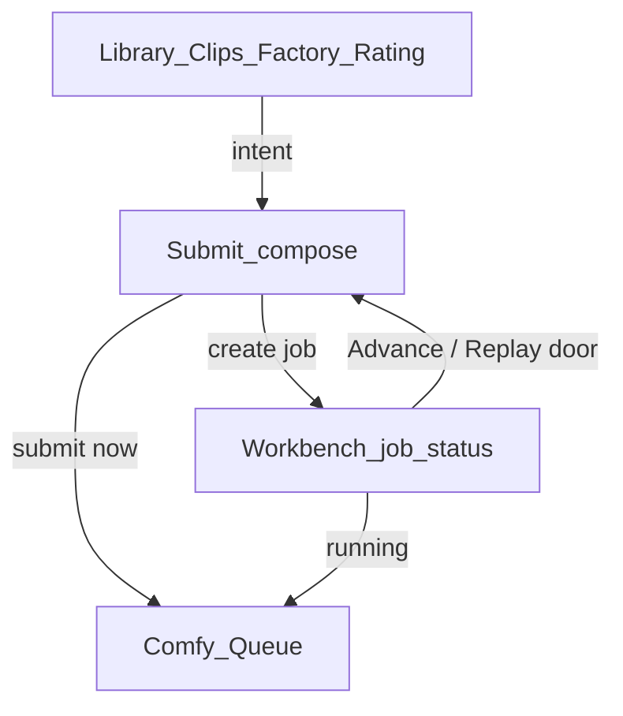

# Submit workflow

**Last updated:** 2026-08-11

Single mechanism for **creating** factory jobs (and optionally submitting them to Comfy). Many entry points deep-link here with intent; they do not each own a private submit UI.

## Roles (working proposal — not locked)

Judge by the UI, not this table. Until Submit feels right next to Workbench, ownership below is a **draft split** to steer the refactor.

| Surface | Proposed owns | Proposed does *not* own |
|---------|---------------|-------------------------|
| **Submit** (`/submit`) | Compose next job: media stage, Use (trim/clips), family/step, identity, now/later, construction preview | Job list, pending-job mutation, live Comfy watch |
| **Workbench** (`/workbench`) | Job **status**: list/filter, pending trim on *this* job, unqueue/discard, bindings/JSON, result preview, doors into Submit | Inline create / Quick queue Advance |
| **Queue** (`/comfy-queue`) | Live Comfy running / pending / history | Compose or job CRUD |
| **Library / Clips / Factory / Rating** | Find & judge; hand off intent to Submit | Private submit UIs |

**Visual target:** Submit should feel like Workbench’s compose chrome (viewer + trim + clips + identity + now/later), not a form card. Workbench keeps that chrome only where it mutates or inspects an *existing* job.

**Terminology:** Workbench manages **job status**, not “lifecycle.” *Lifecycle* is reserved for a future generational design across many outputs.

## Intent query (`/submit?…`)

| Param | Meaning |
|-------|---------|
| `media` | Parent media relpath (required for clip/extend compose) |
| `clip_id` | Shape-factory clip id (preferred Use) |
| `mark_in` / `mark_out` | Seconds; used when no clip_id |
| `family` | Factory family slug |
| `identity` | Absolute or resolvable identity-still path |
| `when` | `now` \| `later` (default later in UI; user can change) |
| `from_job` | Seed job key (later doors) |
| `step` | Disposition step (default `advance.extend`) |
| `origin` | Optional label of the door (`library`, `clips`, …) |

## Canonical pipe

1. Resolve **Use** (clip → marks → full) + family + optional identity + priority.
2. Create work-item route + run disposition step (`advance.extend`) / equivalent factory queue.
3. **Submit now** (`front` / queue_now) vs **later** (pending for hourly / Workbench).
4. Success: links to Workbench (`?job=`) and Comfy Queue.

## Construction preview

Submit shows a **pre-job intent** panel (not Workbench’s post-job `details` / `construction` blob). It is computed client-side from the current compose state:

| Chip / row | Meaning |
|------------|---------|
| Route chips | Extend / Vary / Derive + family (+ `shape_id` when known) |
| Priority chip | Intended `now` vs `later` (from `?when=` or last button; Now/Later still commit) |
| Use | Clip label/id or scrubber + mark in–out |
| VHS | Derived `skip_first_frames` / `frame_load_cap` (+ clamp warning) |
| Identity | Required / set / not required for Extend |
| Context | `origin` / `from_job` when deep-linked |
| Ready | Mirrors whether Now/Later can run (blockers: window, route, identity, …) |

After commit, inspect the real job on Workbench. The Submit panel keeps reflecting compose state, not the created job.

## Doors (first slice)

- Library / Clips: “Open in Submit” via `submitHref` (replaces inline Queue now/later on the clip rail).
- Workbench: “Open in Submit” for Advance (Extend / Vary / Derive); re-run / unqueue / archive / delete stay on Workbench.

Later (if the split holds): Factory map, Rating Advance → same href shape.

## Naming

Call this surface **Submit**. Do not call it “Queue” — that label stays on `/comfy-queue`.
