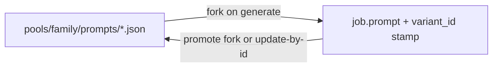

# Prompt variant management

Prompt-library application of the app-wide catalog contract in
[CATALOG_IDENTITY.md](./CATALOG_IDENTITY.md). Runtime rule: catalog / shape / stack YAML
are **seeds**; after generate, **`job["prompt"]` + adhoc overrides + stamped `stack_id`**
are truth until the operator **promotes**.

**Last updated:** 2026-09-24

---

## Vocabulary

| Term | Meaning |
|------|---------|
| `variant_id` | Opaque UUID. Identity for lineage and jobs. |
| `name` | Mutable operator label. Never only `"default"`. |
| `available` | If false, hidden from pickers (and later hourly). |
| `default_variant_id` | Family designation in `pools/<family>/prompt_catalog.json`. |
| `content_hash` | Text identity; snowflake / “edited” when owned ≠ seed. |
| `prompt_profile` | Binding **slot name**, not a variant id. |
| File stem | e.g. `catalog-default.json` — storage accident; not identity. |
| Slug | Kebab hint derived from name/stem; not identity. |
| `stack_id` / `run_spec` | Weights policy vs extracted display of what will run. |

**Deprecate:** treating slug/stem `"default"` / filename `catalog-default.json` as
“the default variant.” Default is only `default_variant_id → variant_id`.

---

## Seed → owned → promote



| Concern | Seed | Job truth | Promote target |
|---------|------|-----------|----------------|
| Prompt text | `pools/<family>/prompts/*.json` | `job.prompt` (+ `content_hash`, `variant_id`, name snapshot) | library JSON by id (fork = new id) |
| Params | shape `ui_defaults` + template | `adhoc_overrides.parameters` | catalog LiteGraph |
| LoRAs | template Power Lora Loader | `job.loras` / adhoc | catalog LiteGraph |
| Stack | shape `stack:` + `.data/stacks/*.yaml` | `adhoc_overrides.stack` / `job.stack_id` | pick another stack |

---

## Library schema

Each `pools/<family>/prompts/<stem>.json` (variant files only — not meta sidecars):

```json
{
  "variant_id": "<uuid>",
  "name": "Base",
  "available": true,
  "label": "…",
  "slug": "base",
  "positive": "…",
  "negative": "…",
  "content_hash": "…"
}
```

Sidecar `pools/<family>/prompt_catalog.json` (sibling of `prompts/`, so `prompts/*.json` globs never list it):

```json
{
  "schema_version": "comfyui-runpod.prompt-catalog.v0",
  "default_variant_id": "<uuid>"
}
```

Normalize / backfill:

```bash
python workspace/scripts/shape_factory.py prompt-catalog backfill [--family SLUG] [--apply]
```

---

## Operator flows

1. **Pick** — Submit / Workbench list `available` variants; badge “Default” from designation.
2. **Generate** — fork stamps `variant_id` + `variant_name` (snapshot) onto `job.prompt`.
3. **Edit** — pre-Comfy edits owned text; “edited” when `content_hash` ≠ seed for that id.
4. **Rename / availability / set default** — catalog APIs; id stable; jobs unchanged.
5. **Promote fork** — new `variant_id` + operator-chosen `name`.
6. **Promote update** — write text into an existing `variant_id` (preserves id + name).
7. **Make default** — separate designation call (`default_variant_id = …`), not overwrite-by-filename.

Hourly still filters `catalog-*` filenames today; intent is to honor `available` once
backfill is trusted (see CATALOG_IDENTITY adoption table).

---

## Code pointers

- [`workspace/scripts/shape_factory_owned_prompt.py`](../workspace/scripts/shape_factory_owned_prompt.py) — fork, stamp, promote, catalog index.
- [`workspace/scripts/shape_factory_work_products.py`](../workspace/scripts/shape_factory_work_products.py) — `list_family_prompt_profiles`.
- Experiments UI: Submit / Workbench pickers, promote dialogs, `submitFamily.ts` helpers.

See also: [WORKFLOW_LAYERS.md](./WORKFLOW_LAYERS.md), [`.data/stacks/README.md`](../.data/stacks/README.md),
[RUN_SPEC_DISPLAY_PLAN.md](./RUN_SPEC_DISPLAY_PLAN.md), [CLIP_SELECTION_MODEL.md](./CLIP_SELECTION_MODEL.md).
