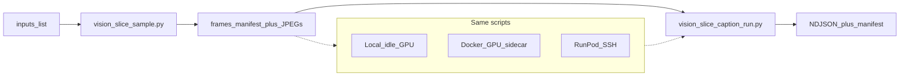

# Vision V1 — time-slice caption spike (implementation plan)

**Status:** Ready to build (locked 2026-07-14; **run-anywhere** clarified same day).  
**Program:** P1 look/reads-like — first slice in the V1–V5 sequence ([`DISCOVERY_SEARCH_AND_SIMILARITY_VISION.md`](./DISCOVERY_SEARCH_AND_SIMILARITY_VISION.md)).  
**Hub:** [`PLANNING_OVERVIEW.md`](./PLANNING_OVERVIEW.md).

---

## Question (learn gate)

Does **in-asset time** improve curation and “reads like” recall versus **one caption/tag blob per video**?

| Outcome | Next |
|---------|------|
| **Keep** | Index span rows; later Discovery jump-to-span; feed V2/V3a with slice-aware jobs |
| **Pivot** | Prefer coarser chunking (e.g. 3–5 keyframes only) and re-judge |
| **Kill** | Whole-video tags only for now; park slice UX; optionally jump to **V2→V3a** |

Write one retrospective paragraph in Planning Overview *Notes* after the spot-check.

---

## Design principle: run anywhere

Jobs are **portable Python entrypoints** keyed by **content** (`asset_relpath` / optional `content_id`), not by host. Where the GPU lives is a **runner**, not part of the job contract.



| Layer | Responsibility |
|-------|----------------|
| **Job** | Sample frames; caption frames; write NDJSON + manifest with `model_pin`, `run_id`, `runner` |
| **Runner** | Provide Python+CUDA (or CPU dry-run), ffmpeg, model weights, writable work dir |
| **Never hardcode** | Absolute host paths in outputs; “must be RunPod”; Comfy interactive session |

**Runners (any one is enough for V1):**

| Runner | When to use |
|--------|-------------|
| **Local idle GPU** | Comfy stopped / drained; same machine as data |
| **Docker GPU sidecar** | Separate compose profile / container that mounts `output/` read + `_status/` write |
| **RunPod (or any remote)** | Optional; sync staging ↔ home via rsync/scp — see [`../RUNPOD.md`](../RUNPOD.md) |

Hard rule: do **not** share the interactive Comfy GPU without an explicit drain. Manifest records `runner: local|docker|runpod|other`.

This shape foreshadows **V2** `asset_job_worker` GPU handlers: same job body, queued later; V1 just invokes the scripts directly.

---

## In scope

- ~**12** short videos from `og/` (diverse motion / subject; prefer already-rated or hourly keepers).
- **Chunking (ship one):** fixed **2.0 s** non-overlapping windows (trim last window to EOF). Mid-frame (or first frame of window) as the caption image.
- **Offline captions** on **any** capable runner above.
- **Outputs:** NDJSON sidecars under `_status/` (schema below); optional whole-video caption line per asset for A/B.
- **Human spot-check:** for each video, skim 3–5 slice captions vs one whole-video caption; note useful / noise / worse.

## Out of scope

- Temporal NL (“X then Y”); ANN/CLIP; Discovery product UI; HITL queues; Florence wiring into `asset_tags` (that is **V3a**).
- Face identity embeddings; live VLM in Experiments UI.
- Changing hourly / ratings pipelines (consumers stay prompt-bootstrap tags until V3a).
- Full V2 watcher/queue (optional later reuse of these scripts as handlers).

---

## Artifacts

| Path | Role |
|------|------|
| `output/_status/vision_slice_captions.ndjson` | Append-only rows (or overwrite full rebuild for spike) |
| `output/_status/vision_slice_manifest.json` | Run metadata: model pin, video list, window_sec, `runner`, started/finished UTC |
| `output/_status/vision_v1_spotcheck.md` | Human notes (keep / pivot / kill + examples) |
| Staging dir | frames + `frames_manifest.json` — local, Docker volume, or remote work dir |

NDJSON row (one line per slice):

```json
{
  "schema": 1,
  "asset_relpath": "og/2026-07-14/hourly/....mp4",
  "content_id": optional_sha256_or_null,
  "t0": 0.0,
  "t1": 2.0,
  "frame_t": 1.0,
  "caption": "…",
  "tags": ["optional", "normalized", "keywords"],
  "provider": "florence2",
  "model_pin": "florence-community/Florence-2-base",
  "run_id": "vision_v1_20260714",
  "runner": "local"
}
```

Whole-video compare row: same shape with `t0=0`, `t1=<duration>`, `"slice": "whole"`.

Env / CLI the jobs honor (portable):

| Var / flag | Meaning |
|------------|---------|
| `VISION_DATA_ROOT` / `--data-root` | Root that contains `og/` (or bind-mount equivalent) |
| `VISION_STATUS_DIR` / `--status-dir` | Where NDJSON + manifest land (default `<data>/output/_status`) |
| `VISION_WORK_DIR` / `--work-dir` | Staging for JPEGs + frame manifest |
| `VISION_DEVICE` / `--device` | `cuda` \| `cpu` (cpu = dry-run / smoke only) |
| `VISION_MODEL_PIN` / `--model-pin` | Weights id recorded in manifest |

---

## Scripts (repo)

Under `workspace/scripts/` (**implemented** — V1 scaffolding):

| Script | Responsibility |
|--------|----------------|
| [`vision_slice_sample.py`](../workspace/scripts/vision_slice_sample.py) | Inputs → ffprobe windows, ffmpeg mid-frames, `frames_manifest.json`. **CPU-only**. |
| [`vision_slice_caption_run.py`](../workspace/scripts/vision_slice_caption_run.py) | Frames → NDJSON + `vision_slice_manifest.json`. `--dry-run` or Florence-2 via `transformers`. |
| [`vision_slice_sync.sh`](../workspace/scripts/vision_slice_sync.sh) | Optional rsync push/pull for remote runners (`VISION_REMOTE`). |

Tests: [`test_vision_slice.py`](../workspace/tests/test_vision_slice.py).

Same entrypoints later become V2 GPU handlers.

**Model choice for spike (fixed):** Florence-2 (HF or runner-local weights) in caption mode on stills. Pin the exact string in the manifest. Do not chase multiple models in V1.

---

## Operator runbook (runner-agnostic)

1. **Select ~12 videos** — `vision_v1_inputs.txt` (one `asset_relpath` per line).
2. **Sample (any machine with videos + ffmpeg):**  
   `python3 vision_slice_sample.py --inputs … --window-sec 2 --work-dir "$VISION_WORK_DIR"`
3. **Caption on chosen runner** (pick one):
   - **Local:** Comfy drained → same host, same `--work-dir` / `--status-dir`.
   - **Docker:** start GPU sidecar mounting data + work + status; same two scripts.
   - **Remote:** `vision_slice_sync.sh push` → SSH run `vision_slice_caption_run.py` → `pull` NDJSON/manifest.
4. **Spot-check** — fill `vision_v1_spotcheck.md`.
5. **Tear down** paid/remote capacity if used; leave local/Docker idle.
6. **Retrospective** — one paragraph in Planning Overview; set Next to V2 or park V1.

---

## Success criteria

- [ ] 12 videos processed with fixed 2 s windows + one whole-video caption each.
- [ ] NDJSON + manifest under `_status/` with `model_pin` and `runner` recorded.
- [ ] Spot-check answers: slices **clearly better** / **mixed** / **not worth it** vs whole-video.
- [ ] No unpaid remote GPU left running (if a remote runner was used).
- [ ] Scripts ran with the **same CLI** on the chosen runner (no RunPod-only code paths in job bodies).
- [ ] Planning Overview **Suggested focus** updated after retrospective.

## Non-goals for “done”

Discovery UI consuming NDJSON; watcher enqueue; merging into `asset_tags.json`.

---

## Risks

| Risk | Mitigation |
|------|------------|
| Comfy GPU contention | Explicit drain before local runner; prefer sidecar/remote when generating |
| Caption model installs eat the session | Pin weights once per runner; reuse existing Florence install |
| Overlong videos → huge frame sets | Cap windows per asset (e.g. max 30); note truncation in manifest |
| Path drift across machines | `asset_relpath` + optional `content_id` only in NDJSON; mounts map roots via env |
| “Run anywhere” scope creep | V1 still one model + fixed windows; runners are adapters, not new products |

---

## After V1

- **Keep** → V2 ([`DISCOVERY_INDEX_WATCHER_PLAN.md`](./DISCOVERY_INDEX_WATCHER_PLAN.md)): enqueue these same scripts as GPU job types.
- **Kill slices** → still do V2 plumbing; V3a whole-asset tags without span rows.
- Product BM25 / jump-to-span wait for **V4** after useful text exists.

---

*V1 scaffolding scripts are in-repo; run a dry-run pass before attaching Florence on a GPU runner.*
