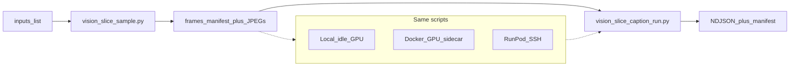

# Vision V1 — time-slice caption spike (implementation plan)

**Status:** V1 spike complete (2026-07-16) — **Keep** time slices; next is V2 job stubs. Tag pin: PromptGen-large now (`_status/vision_v3a_tag_pin.json`), informed union later.  
**Program:** P1 look/reads-like — first slice in the V1–V5 sequence ([`DISCOVERY_SEARCH_AND_SIMILARITY_VISION.md`](./DISCOVERY_SEARCH_AND_SIMILARITY_VISION.md)).  
**Hub:** [`PLANNING_OVERVIEW.md`](./PLANNING_OVERVIEW.md).

---

## Question (learn gate)

Does **in-asset time** improve curation and “reads like” recall versus **one caption/tag blob per video**?

| Outcome | Next |
|---------|------|
| **Keep** | Index span rows; later Discovery jump-to-span; feed V2/V3a with slice-aware jobs |
| **Pivot** | Prefer coarser chunking (e.g. 3–5 keyframes only) and re-judge |
| **Kill** | Whole-video tags only for now; park slice UX; optionally jump to **V2→V3a** |

Write one retrospective paragraph in Planning Overview *Notes* after the spot-check.

---

## Design principle: run anywhere

Jobs are **portable Python entrypoints** keyed by **content** (`asset_relpath` / optional `content_id`), not by host. Where the GPU lives is a **runner**, not part of the job contract.



| Layer | Responsibility |
|-------|----------------|
| **Job** | Sample frames; caption frames; write NDJSON + manifest with `model_pin`, `run_id`, `runner` |
| **Runner** | Provide Python+CUDA (or CPU dry-run), ffmpeg, model weights, writable work dir |
| **Never hardcode** | Absolute host paths in outputs; “must be RunPod”; Comfy interactive session |

**Runners (any one is enough for V1):**

| Runner | When to use |
|--------|-------------|
| **Local idle GPU** | Comfy stopped / drained; same machine as data |
| **Docker GPU sidecar** | Separate compose profile / container that mounts `output/` read + `_status/` write |
| **RunPod (or any remote)** | Optional; sync staging ↔ home via rsync/scp — see [`../RUNPOD.md`](../RUNPOD.md) |

Hard rule: do **not** share the interactive Comfy GPU without an explicit drain. Manifest records `runner: local|docker|runpod|other`.

This shape foreshadows **V2** `asset_job_worker` GPU handlers: same job body, queued later; V1 just invokes the scripts directly.

---

## In scope

- ~**12** short videos from `og/` (diverse motion / subject; prefer already-rated or hourly keepers).
- **Chunking (ship one):** fixed **2.0 s** non-overlapping windows (trim last window to EOF). Mid-frame (or first frame of window) as the caption image.
- **Offline captions** on **any** capable runner above.
- **Outputs:** NDJSON sidecars under `_status/` (schema below); optional whole-video caption line per asset for A/B.
- **Human spot-check:** for each video, skim 3–5 slice captions vs one whole-video caption; note useful / noise / worse.

## Out of scope

- Temporal NL (“X then Y”); ANN/CLIP; Discovery product UI; HITL queues; Florence wiring into `asset_tags` (that is **V3a**).
- Face identity embeddings; live VLM in Experiments UI.
- Changing hourly / ratings pipelines (consumers stay prompt-bootstrap tags until V3a).
- Full V2 watcher/queue (optional later reuse of these scripts as handlers).

---

## Artifacts

| Path | Role |
|------|------|
| `output/_status/vision_slice_captions.ndjson` | Append-only rows (or overwrite full rebuild for spike) |
| `output/_status/vision_slice_manifest.json` | Run metadata: model pin, video list, window_sec, `runner`, started/finished UTC |
| `output/_status/vision_v1_spotcheck.md` | Human notes (keep / pivot / kill + examples) |
| Staging dir | frames + `frames_manifest.json` — local, Docker volume, or remote work dir |

NDJSON row (one line per slice):

```json
{
  "schema": 1,
  "asset_relpath": "og/2026-07-14/hourly/....mp4",
  "content_id": optional_sha256_or_null,
  "t0": 0.0,
  "t1": 2.0,
  "frame_t": 1.0,
  "caption": "…",
  "tags": ["optional", "normalized", "keywords"],
  "provider": "florence2",
  "model_pin": "florence-community/Florence-2-base",
  "run_id": "vision_v1_20260714",
  "runner": "local"
}
```

Whole-video compare row: same shape with `t0=0`, `t1=<duration>`, `"slice": "whole"`.

Env / CLI the jobs honor (portable):

| Var / flag | Meaning |
|------------|---------|
| `VISION_DATA_ROOT` / `--data-root` | Root that contains `og/` (or bind-mount equivalent) |
| `VISION_STATUS_DIR` / `--status-dir` | Where NDJSON + manifest land (default `<data>/output/_status`) |
| `VISION_WORK_DIR` / `--work-dir` | Staging for JPEGs + frame manifest |
| `VISION_DEVICE` / `--device` | `cuda` \| `cpu` (cpu = dry-run / smoke only) |
| `VISION_MODEL_PIN` / `--model-pin` | Weights id recorded in manifest |

---

## Scripts (repo)

Under `workspace/scripts/` (**implemented** — V1 scaffolding):

| Script | Responsibility |
|--------|----------------|
| [`vision_slice_runner.py`](../workspace/scripts/vision_slice_runner.py) | CaptionRunner API: dry-run, **Comfy/RunPod HTTP**, transformers. |
| [`vision_slice_sample.py`](../workspace/scripts/vision_slice_sample.py) | Inputs → ffprobe windows, ffmpeg mid-frames, `frames_manifest.json`. **CPU-only**. |
| [`vision_slice_caption_run.py`](../workspace/scripts/vision_slice_caption_run.py) | Frames → NDJSON via `make_runner` (`--provider comfy\|runpod\|transformers\|dry-run`). |
| [`vision_slice_pick_inputs.py`](../workspace/scripts/vision_slice_pick_inputs.py) | Scan `og/`, pick ~N diverse clips → `vision_v1_inputs.txt`. |
| [`vision_slice_quality.py`](../workspace/scripts/vision_slice_quality.py) | Classical CV quality on sampled JPEGs → `vision_slice_quality.ndjson` (sharpness, convergence, artifacting, exposure, contrast). **CPU-only**; learned VQA (DOVER/MUSIQ) deferred. |
| [`vision_slice_quality_metrics.py`](../workspace/scripts/vision_slice_quality_metrics.py) | Pure metric helpers (unit-testable without ffmpeg). |
| [`vision_slice_review.py`](../workspace/scripts/vision_slice_review.py) | Package captions (+ quality) for Experiments UI `/vision/slices`. |
| [`vision_slice_dry_run.sh`](../workspace/scripts/vision_slice_dry_run.sh) | Orchestrate pick → sample → caption `--dry-run` (no GPU). |
| [`vision_slice_sync.sh`](../workspace/scripts/vision_slice_sync.sh) | Optional rsync push/pull for remote runners (`VISION_REMOTE`). |
| [`vision_v1_florence_caption.api.json`](../workspace/workflows/vision_v1_florence_caption.api.json) | Reference Comfy API prompt (same graph the Comfy runner builds). |

Tests: [`test_vision_slice.py`](../workspace/tests/test_vision_slice.py), [`test_vision_slice_quality.py`](../workspace/tests/test_vision_slice_quality.py), [`test_vision_slice_review.py`](../workspace/tests/test_vision_slice_review.py).

Same entrypoints later become V2 GPU handlers.

**Model choice for spike (fixed):** Comfy `DownloadAndLoadFlorence2Model` default **`microsoft/Florence-2-base`** (same graph on local compose or RunPod :8188). First run downloads weights into the Comfy models cache — allow a long timeout (`ComfyRunnerConfig.timeout_s`, default 900s). Do not chase multiple models in V1.

### Runner API shape (RunPod-ready)

```text
CaptionRequest(image_path, asset_relpath, meta)
    → CaptionRunner.caption()
    → CaptionResult(caption, provider, model_pin, runner, raw)
```

| Provider | How GPU is reached |
|----------|-------------------|
| `comfy` / `runpod` | HTTP to Comfy `/upload/image` + `/prompt` + `/history/{id}` — **same code**; only `--comfy-server` changes (`http://127.0.0.1:8188` vs `http://<pod>:8188`) |
| `transformers` | In-process torch (optional) |
| `dry-run` | No GPU |

Image ingress: `--image-mode upload` (preferred when runner disk ≠ Comfy disk, including RunPod) or `input_copy` when `VISION_COMFY_INPUT_ROOT` is a shared bind.

---

## Operator runbook (runner-agnostic)

**Fast path (CPU dry-run):**

```bash
VISION_DATA_ROOT=/home/yuji/comfyui-runpod-data/output \
  ./workspace/scripts/vision_slice_dry_run.sh
# optional: VISION_LIMIT=12 VISION_WORK_DIR=/tmp/vision_v1_work
```

**Manual steps:**

1. **Select ~12 videos** — `vision_slice_pick_inputs.py` or edit `vision_v1_inputs.txt` (one `asset_relpath` per line).
2. **Sample (any machine with videos + ffmpeg):**  
   `python3 vision_slice_sample.py --inputs … --window-sec 2 --work-dir "$VISION_WORK_DIR"`
3. **Caption on chosen runner** (pick one):
   - **Local dry-run:** `--provider dry-run` (no model).
   - **Local Comfy (compose :8188):**  
     `python3 vision_slice_caption_run.py … --provider comfy --comfy-server http://127.0.0.1:8188 --image-mode upload --runner comfy`  
     Prefer draining heavy Comfy queues first so Florence can use the GPU.
   - **RunPod Comfy:** same flags with `--provider runpod --comfy-server http://<pod>:8188 --image-mode upload` (`upload` keeps runner FS ≠ pod FS).
   - **transformers:** `--provider transformers` if you want in-process Florence without Comfy.
4. **Spot-check** — fill `vision_v1_spotcheck.md`.
5. **Tear down** paid/remote capacity if used; leave local/Docker idle.
6. **Retrospective** — one paragraph in Planning Overview; set Next to V2 or park V1.

---

## Review UI

Experiments UI **Tools → Vision slices**: `http://127.0.0.1:5179/vision/slices` (Vite) or via the app shell on the container UI.

API: `GET /api/vision/slice-captions` — merges comparative variants by asset+time window; videos via `/files/<asset_relpath>`. Click a slice to seek the player to that mid-frame. Toggle variants in the page header for side-by-side text.

### Comparative caption variants

Each implementation writes its own NDJSON (legacy `vision_slice_captions.ndjson` is treated as `base_caption`):

```text
output/_status/vision_slice_captions__<variant>.ndjson
output/_status/vision_slice_variants.json   # registry / labels
```

```bash
# Example A/B (same frames_manifest, different task / weights)
python3 workspace/scripts/vision_slice_caption_run.py \
  --frames-manifest /tmp/vision_v1_spike12/frames_manifest.json \
  --status-dir "$STATUS" --run-id vision_v1_spike12_detailed \
  --provider comfy --model-pin microsoft/Florence-2-base \
  --task detailed_caption --variant florence_detailed --max-new-tokens 256

python3 workspace/scripts/vision_slice_caption_run.py \
  --frames-manifest /tmp/vision_v1_spike12/frames_manifest.json \
  --status-dir "$STATUS" --run-id vision_v1_spike12_promptgen \
  --provider comfy --model-pin MiaoshouAI/Florence-2-base-PromptGen-v2.0 \
  --task caption --variant florence_promptgen --max-new-tokens 128
```

After changing `vision_slice_review.py`, restart the Experiments UI process (or container) so `/api/vision/slice-captions` picks up the new code; Vite HMR covers the React page.

### Tag model judgment experiment (dev only)

**Not** a production HITL product and **not** wired into Discovery ratings. One sitting to decide which PromptGen tag model(s) to keep for later V3a work.

Compete tag-list NDJSON variants (default: `cohort_x2_pg_tags`, `cohort_x2_pg_large_tags`, plus older `cohort_pg_*` when the same slice key exists). UI marks the **union** of tags blind (model ids hidden); scorer ranks base / large / ∪ / ∩.

```bash
STATUS=/home/yuji/comfyui-runpod-data/output/_status

# 1) Build ~48 stratified samples → vision_tag_judgment_queue.json
python3 workspace/scripts/vision_tag_judgment_queue.py \
  --status-dir "$STATUS" --target-samples 48 --seed 20260716

# 2) Judge in UI (blind good/bad chips)
#    http://127.0.0.1:5179/vision/tag-judge
#    (link from Vision slices header). Keys: g/b, n next, p prev, s skip.
#    Judgments append to vision_tag_judgments.ndjson (idempotent by sample_id).

# 3) Score anytime (also auto-runs on each save)
python3 workspace/scripts/vision_tag_judgment_score.py --status-dir "$STATUS"
# → vision_tag_judgment_leaderboard.json + printed table
# → vision_tag_judgment_tag_stats.json (per-tag good/bad rates for tuning)
```

Per-tag stats (lasting value for V3a / blocklists / hard-negatives):

- `commonly_correct` — high good_rate (stable vocabulary)
- `commonly_misidentified` — high bad_rate (frequent false positives)
- `commonly_important` — tags starred as significant (★); models also get **ImpR** = coverage of important tags
- `contested` — mixed labels (worth manual review)
- full `by_tag[]` in the sidecar JSON, including per-model emit/good/bad counts

**Important vs good/bad:** orthogonal. Click / space cycles good→bad→unmarked; `i` or Alt+click toggles ★ important without clearing the label. Once starred, a tag stays in the session vocabulary and is pre-starred when it reappears on later samples.

**Chronic false positives / true positives:** tags with ≥2 labels and ≥75% bad (or good) rate are **suggested** on new samples (dashed chips). Override when wrong — those flips are the interesting signal. Samples stay “undone” until you save.

**Missing tags round:** use **Missing pass** after ★ Important. Candidates are **only** your ★ important vocabulary tags that are absent from this sample’s union. Mark each that *should have been* emitted (gold FN for important tags); leave unmarked if it correctly does not belong on this sample. Optional freeform add is for rare ★-class misses not yet in the vocab. Saved as `missing: [...]`; scorer reports `commonly_missing` and `missing_n` / extended recall.

API: `GET` / `POST` `/api/vision/tag-judgment`. Restart the Experiments API process after pulling these routes if the proxy still 404s.

---

## Success criteria

- [x] 12 videos processed with fixed 2 s windows + one whole-video caption each.
- [x] NDJSON + manifest under `_status/` with `model_pin` and `runner` recorded.
- [x] Spot-check answers: slices **clearly better** / **mixed** / **not worth it** vs whole-video. → **Keep** (2026-07-16)
- [x] No unpaid remote GPU left running (if a remote runner was used).
- [x] Scripts ran with the **same CLI** on the chosen runner (no RunPod-only code paths in job bodies).
- [x] Planning Overview **Suggested focus** updated after retrospective.

## Non-goals for “done”

Discovery UI consuming NDJSON; watcher enqueue; merging into `asset_tags.json`.

---

## Risks

| Risk | Mitigation |
|------|------------|
| Comfy GPU contention | Explicit drain before local runner; prefer sidecar/remote when generating |
| Caption model installs eat the session | Pin weights once per runner; reuse existing Florence install |
| Overlong videos → huge frame sets | Cap windows per asset (e.g. max 30); note truncation in manifest |
| Path drift across machines | `asset_relpath` + optional `content_id` only in NDJSON; mounts map roots via env |
| “Run anywhere” scope creep | V1 still one model + fixed windows; runners are adapters, not new products |

---

## After V1

- **Keep** → V2 ([`DISCOVERY_INDEX_WATCHER_PLAN.md`](./DISCOVERY_INDEX_WATCHER_PLAN.md)): enqueue these same scripts as GPU job types.
- **Kill slices** → still do V2 plumbing; V3a whole-asset tags without span rows.
- Product BM25 / jump-to-span wait for **V4** after useful text exists.

---

*V1 scaffolding scripts are in-repo; run a dry-run pass before attaching Florence on a GPU runner.*
