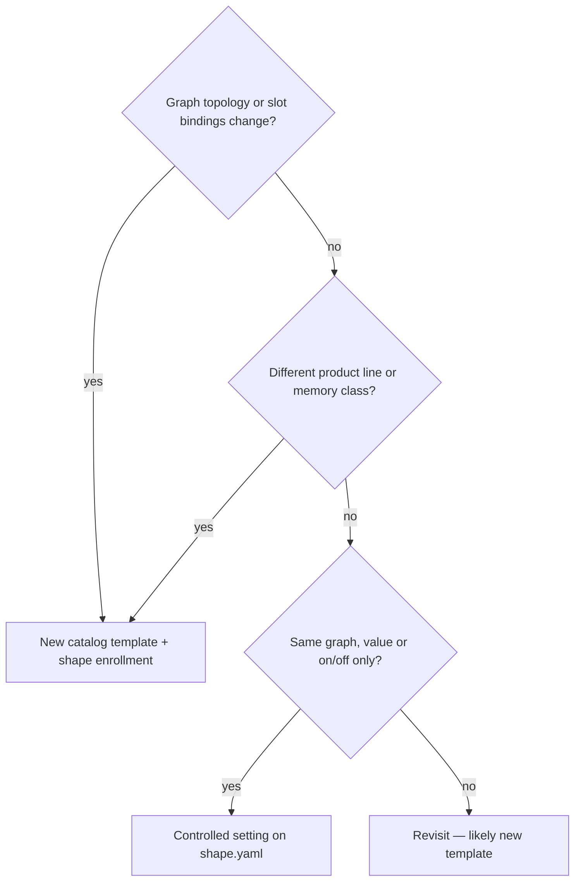

# Workflow layers — generation, postprocess, runtime

Factory jobs are built from a **catalog template** (LiteGraph JSON) plus **shape policy**
([`.data/shapes/*.shape.yaml`](../.data/shapes/*.shape.yaml)). Three concerns are mixed
in the template file today; this doc names them so shapes, templates, and operators
stay aligned.

See also: [`.data/shapes/README.md`](../.data/shapes/README.md) (station vocabulary),
[`docs/WORKFLOW_INTENT.md`](WORKFLOW_INTENT.md) (factory metaphor).

## Target architecture: delivery postprocess is a separate station

**Decision:** upscale (RealESRGAN) and interpolation (RIFE) are **not** part of the
generation graph. They run as an optional **pipeline step** after `final_video` exists.


Generation fingerprints (`graph_hash`) should describe **how video is made**, not
optional delivery transforms you are not running in production.

### Two categories (do not conflate)

| Category | Where it lives | Effects | In production today |
|----------|----------------|---------|---------------------|
| **Delivery postprocess** | Separate denouement shape + optional pipeline tail | ColorMatch, RealESRGAN 4×, RIFE | **Off by default** — opt-in via `delivery:` block |
| **Generation editorial** | Stays in the generation graph | ColorMatch (extend), VHS_MergeImages, batch trim | **On** on extend lines where wired |

ColorMatch on GEX extend uses in-graph frames (source vs generated). That is part of
the extend **recipe**, not a delivery step. Same for merge/trim on long extend chains.

### Why remove delivery nodes from generation **now**

`graph_hash` uses **topology** (node types + edges), not bypass state. Muted
`ImageUpscaleWithModel` / `RIFE VFI` nodes still fingerprint as part of the graph
(see `graph_fingerprint_topology` in [`shape_factory_vocab.py`](../workspace/scripts/shape_factory_vocab.py)).

| | Remove delivery postprocess now | Leave embedded + bypass |
|--|--------------------------------|-------------------------|
| **Fingerprint** | Generation hash = generation only | Hash permanently includes dead upscale/RIFE topology |
| **Inventory** | `embedded_postprocess` flag clears on gen templates | Snowflake keeps recommending a split you already chose |
| **Operational** | No `rife47.pth` references in gen jobs | Missing-weight risk if a template save unmutes a node |
| **Cost** | One bounded migration (~6 distinct origin catalogs) | Cheaper today, messier as more families enroll |

**Recommendation: yes — strip delivery postprocess from generation templates now.**
Postprocess shapes and pipeline wiring can follow; production does not use upscale/RIFE
today, so nothing breaks by removing unused nodes first.

The interim apply layer ([`shape_factory_generation_editorial.py`](../workspace/scripts/shape_factory_generation_editorial.py))
sets **generation editorial** policy (`color_match`, `merge_frames`) on shapes that
declare a `postprocess:` block. Delivery effects use a separate denouement workflow with
a `delivery:` block — see [`.data/shapes/delivery/README.md`](../.data/shapes/delivery/README.md).

---

## The three layers

| Layer | Controls | Shape touchpoint | Examples |
|-------|----------|------------------|----------|
| **Generation** | Model stack, latent size, LoRAs, editorial nodes, core topology | `template:` path (+ future `stack_profile`) | UNet, LoRAs, ColorMatch on extend, VHS_MergeImages |
| **Delivery postprocess** | Optional video-in → video-out transforms | `wan-delivery-postprocess` + `delivery:` toggles | ColorMatch, RealESRGAN, RIFE |
| **Runtime** | Per-run tuning on a stable graph | `ui_defaults`, `dev-fast.yaml`, adhoc params, promote | frames, steps, overlap, seed, VHS clip window |

### Delivery postprocess (denouement workflow)

One graph (`wan-delivery-postprocess`), separate from generation. Each effect is an
**optional component** toggled via the shape `delivery:` block (or per-job
`adhoc_overrides.delivery`):

| Key | Node type | Effect | Model weight |
|-----|-----------|--------|--------------|
| `color_match` | `ColorMatch` | Color transfer vs source | — |
| `upscale` | `ImageUpscaleWithModel` | Higher **resolution** (4×) | `RealESRGAN_x4plus.pth` |
| `interpolate` | `RIFE VFI` | More **frames**, smoother motion | `rife47.pth` |

Apply module: [`shape_factory_delivery_postprocess.py`](../workspace/scripts/shape_factory_delivery_postprocess.py)

### Generation editorial (stays in generation graph)

| Key | Node type | Effect |
|-----|-----------|--------|
| `color_match` | `ColorMatch` | Color transfer / consistency across extend |
| `merge_frames` | `VHS_MergeImages` | Merge frame batches in long extend chains |

---

## Migration plan

### Phase 1 — Strip delivery postprocess from generation catalogs — **complete**

Completed 2026-09-03 (commit `11bf7cb`):

- Origin catalogs stripped (upscale/RIFE nodes + spurs); GEX bypassers removed
- Shape `graph_hash` values updated; `upscale`/`interpolate` removed from shape YAML
- Hash remap manifest:
  [`.data/shapes/graph_hash_migration_delivery_postprocess_2026-09-03.yaml`](../.data/shapes/graph_hash_migration_delivery_postprocess_2026-09-03.yaml)
- Editorial apply narrowed to [`shape_factory_generation_editorial.py`](../workspace/scripts/shape_factory_generation_editorial.py)

Catalog backups: `*.pre-delivery-strip.bak` beside each edited template under
`comfyui-runpod-data/.../catalog/`.

### Phase 2 — Delivery postprocess shape(s) — **complete**

Completed 2026-09-03:

- `video_only` input profile in [`shape_factory_vocab.py`](../workspace/scripts/shape_factory_vocab.py)
- Catalog builder: [`build_delivery_catalogs.py`](../workspace/scripts/build_delivery_catalogs.py)
- Enrolled denouement shape: `wan-delivery-postprocess`
  ([`.data/shapes/delivery/`](../.data/shapes/delivery/))
- Apply module: [`shape_factory_delivery_postprocess.py`](../workspace/scripts/shape_factory_delivery_postprocess.py)
- Opt-in example pipeline: [`kneel-deliver.pipeline.yaml`](../.data/pipelines/kneel-deliver.pipeline.yaml)

**Not on hourly drains** — wire delivery explicitly when needed.

### Phase 3 — Pipeline tail (opt-in) — **partial**

Example pipeline exists (`kneel-deliver`). Extend / GEX delivery tails remain manual until needed.

Example when wired later:

```yaml
steps:
  - id: kneel
    shape: …/X-KNEEL-FB9.shape.yaml
  - id: gex
    shape: …/FB9_GEX.shape.yaml
  # Optional — not on default hourly drains:
  - id: deliver
    shape: …/wan-delivery-postprocess.shape.yaml
    binds_override:
      source_video: { from: pool, pool: FB9_GEX_X_og, pick: last }
    # delivery: { interpolate: true, upscale: false, color_match: false } on shape YAML
```

Hourly drains stay generation-only until delivery shapes exist and are wired explicitly.

---

## Separate template vs controlled setting

Use this decision tree when adding or changing recipes:



**Delivery postprocess is never a controlled setting on a generation shape** — it is
a different station or pipeline step.

### Keep separate templates for

- Different `graph_hash` (identity anchor, VI2V vs V2V, different node types)
- Different product lines run in parallel (origin I2V vs extend V2V)
- Delivery postprocess recipes (**one denouement graph**; toggle `color_match` / `upscale` / `interpolate`)

**Default:** one canonical **generation** template per topology — not one per Q/fp variant.

### Use controlled settings for

- Runtime knobs (frames, steps, overlap, seed, trim)
- Generation editorial on/off (`color_match`, `merge_frames`) where the nodes exist
- Future: `stack_profile` only with validation

---

## Generation editorial policy (`postprocess:` on shape)

The YAML key remains `postprocess:` for compatibility; it controls **editorial**
nodes only (`color_match`, `merge_frames`). Delivery effects belong in Phase 2 shapes.

```yaml
postprocess:
  profile_id: gex-extend-default
  color_match: true
  merge_frames: true
```

Factory apply sets node `mode`: `0` active, `2` bypass. Shape-level default; optional
per-job override via `adhoc_overrides.postprocess`.

### Production defaults (enrolled families)

| Line | Families | Editorial policy |
|------|----------|------------------|
| **720p Q5 origin** | X-KNEEL-FB9*, FB8VA*, BounceDanceA, FB9-FaceBlast | color_match **on** where present |
| **480p Q8 extend** | FB9_GEX2, ASTONISH_FB9_GEX, FB9_GEX, FB9_GEX_FACIAL | merge_frames **on**; color_match **on** on GEX2 only |
| **VI2V identity anchor** | FB9_GEX2_identity_anchor | color_match **off**; merge_frames **on** |

---

## Deferred: model stack profiles

**Status:** not implemented — one stack per family is sufficient for now.

480p Q8 vs 720p Q5 today means **separate catalog templates**, not a runtime switch.

**Revisit when:** you need to A/B quant tiers on the same `graph_hash` without forking catalog JSON.

---

## Implementation map

| Concern | Module | Status |
|---------|--------|--------|
| Generation editorial apply | [`workspace/scripts/shape_factory_generation_editorial.py`](../workspace/scripts/shape_factory_generation_editorial.py) | Done |
| Strip delivery nodes | [`workspace/scripts/strip_delivery_postprocess.py`](../workspace/scripts/strip_delivery_postprocess.py) | Done (Phase 1) |
| Generate / submit wiring | [`workspace/scripts/shape_factory.py`](../workspace/scripts/shape_factory.py) | Done |
| Hash migration record | [`.data/shapes/graph_hash_migration_delivery_postprocess_2026-09-03.yaml`](../.data/shapes/graph_hash_migration_delivery_postprocess_2026-09-03.yaml) | Done |
| Delivery apply | [`workspace/scripts/shape_factory_delivery_postprocess.py`](../workspace/scripts/shape_factory_delivery_postprocess.py) | Done |
| Delivery shape | [`.data/shapes/delivery/`](../.data/shapes/delivery/) | Done |
| Pipeline tail | `.data/pipelines/` | Partial (opt-in examples) |
| Tests | [`workspace/tests/test_shape_factory_postprocess.py`](../workspace/tests/test_shape_factory_postprocess.py) | Done |

## Graph hash migration record (2026-09-03)

Phase 1 strip changed `graph_hash` on 12 enrolled families. Historical jobs and
`by_graph_hash` ratings rollups still reference the **before** hashes.

**Remap manifest:** [`.data/shapes/graph_hash_migration_delivery_postprocess_2026-09-03.yaml`](../.data/shapes/graph_hash_migration_delivery_postprocess_2026-09-03.yaml)

- `hash_pairs` — unique `before` → `after` topology fingerprints (use for merging stats)
- `enrolled_shapes` — per-family mapping with shape paths and templates
- `other_catalogs_stripped` — non-enrolled catalog files also edited in the same pass

Example remap when merging `by_graph_hash` aggregates:

```python
MIGRATION = yaml.safe_load(open(".../graph_hash_migration_delivery_postprocess_2026-09-03.yaml"))
ALIAS = {p["before"]: p["after"] for p in MIGRATION["hash_pairs"]}
canonical = ALIAS.get(gh, gh)  # fold old bucket into new
```
