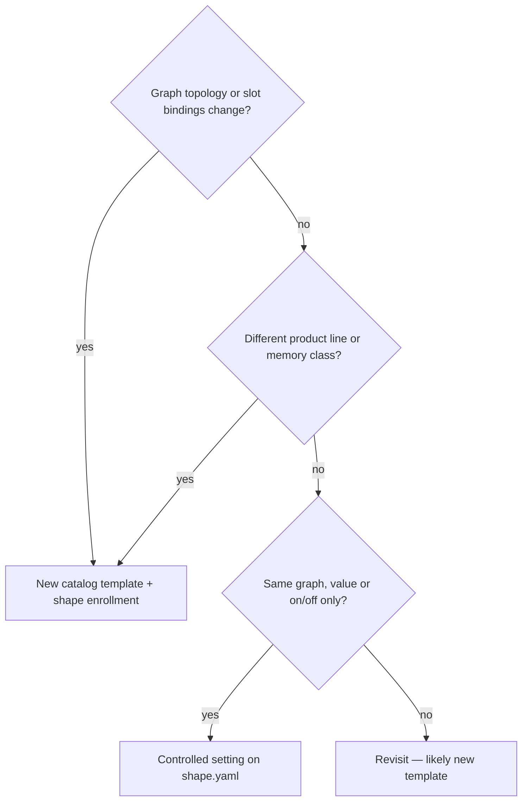

# Workflow layers — generation, postprocess, runtime

Factory jobs are built from a **catalog template** (LiteGraph JSON) plus **shape policy**
([`.data/shapes/*.shape.yaml`](../.data/shapes/*.shape.yaml)). Three concerns are mixed
in the template file today; this doc names them so shapes, templates, and operators
stay aligned.

See also: [`.data/shapes/README.md`](../.data/shapes/README.md) (station vocabulary),
[`docs/WORKFLOW_INTENT.md`](WORKFLOW_INTENT.md) (factory metaphor).

## Target architecture: delivery postprocess is a separate station

**Decision:** upscale (RealESRGAN) and interpolation (RIFE) are **not** part of the
generation graph. They run as an optional **pipeline step** after `final_video` exists.


Generation fingerprints (`graph_hash`) should describe **how video is made**, not
optional delivery transforms you are not running in production.

### Two categories (do not conflate)

| Category | Where it lives | Effects | In production today |
|----------|----------------|---------|---------------------|
| **Delivery postprocess** | Separate shape + optional pipeline tail | RealESRGAN 4× upscale, RIFE frame interpolation | **Off** — remove from generation templates |
| **Generation editorial** | Stays in the generation graph | ColorMatch, VHS_MergeImages, batch trim | **On** on extend lines where wired |

ColorMatch on GEX extend uses in-graph frames (source vs generated). That is part of
the extend **recipe**, not a delivery step. Same for merge/trim on long extend chains.

### Why remove delivery nodes from generation **now**

`graph_hash` uses **topology** (node types + edges), not bypass state. Muted
`ImageUpscaleWithModel` / `RIFE VFI` nodes still fingerprint as part of the graph
(see `graph_fingerprint_topology` in [`shape_factory_vocab.py`](../workspace/scripts/shape_factory_vocab.py)).

| | Remove delivery postprocess now | Leave embedded + bypass |
|--|--------------------------------|-------------------------|
| **Fingerprint** | Generation hash = generation only | Hash permanently includes dead upscale/RIFE topology |
| **Inventory** | `embedded_postprocess` flag clears on gen templates | Snowflake keeps recommending a split you already chose |
| **Operational** | No `rife47.pth` references in gen jobs | Missing-weight risk if a template save unmutes a node |
| **Cost** | One bounded migration (~6 distinct origin catalogs) | Cheaper today, messier as more families enroll |

**Recommendation: yes — strip delivery postprocess from generation templates now.**
Postprocess shapes and pipeline wiring can follow; production does not use upscale/RIFE
today, so nothing breaks by removing unused nodes first.

The interim `postprocess:` apply layer ([`shape_factory_postprocess.py`](../workspace/scripts/shape_factory_postprocess.py))
was a bridge. After stripping, it applies only to **generation editorial**
(`color_match`, `merge_frames`); `upscale` / `interpolate` keys become no-ops and are
removed from shape YAML once catalogs are clean.

---

## The three layers

| Layer | Controls | Shape touchpoint | Examples |
|-------|----------|------------------|----------|
| **Generation** | Model stack, latent size, LoRAs, editorial nodes, core topology | `template:` path (+ future `stack_profile`) | UNet, LoRAs, ColorMatch on extend, VHS_MergeImages |
| **Delivery postprocess** | Optional video-in → video-out transforms | Future `*.postprocess.shape.yaml` + pipeline step | RealESRGAN, RIFE |
| **Runtime** | Per-run tuning on a stable graph | `ui_defaults`, `dev-fast.yaml`, adhoc params, promote | frames, steps, overlap, seed, VHS clip window |

### Delivery postprocess effects

| Step | Node type | Effect | Model weight |
|------|-----------|--------|--------------|
| Upscale | `ImageUpscaleWithModel` | Higher **resolution** (4×) | `RealESRGAN_x4plus.pth` |
| Interpolate | `RIFE VFI` | More **frames**, smoother motion | `rife47.pth` |

Upscale and interpolation are **not** the same. A delivery station may expose either,
both, or a small menu of postprocess shapes.

### Generation editorial (stays in generation graph)

| Key | Node type | Effect |
|-----|-----------|--------|
| `color_match` | `ColorMatch` | Color transfer / consistency across extend |
| `merge_frames` | `VHS_MergeImages` | Merge frame batches in long extend chains |

---

## Migration plan

### Phase 1 — Strip delivery postprocess from generation catalogs (do now)

**Scope — remove from origin (720p Q5) templates:**

- `UpscaleModelLoader`, `ImageUpscaleWithModel`, `RIFE VFI`
- Supporting wiring only used by those branches
- rgthree bypassers targeting **Upscaler** / **Interpolation** groups (if present)

**Affected catalogs:** one shared graph for X-KNEEL-FB9 + bare; plus BounceDanceA,
Breast-shake-FB8VA5, FB8VA4, FB8VA5-ZOOMOUT, FB8VB2 (~6 files, ~8 enrolled shapes).

**Scope — remove from extend (480p Q8) templates:**

- rgthree bypassers for **Upscaler** / **Interpolation** only (no upscale/RIFE nodes exist)
- Keep ColorMatch, VHS_MergeImages, and other extend-recipe nodes

**Per template:**

1. Edit catalog `*-readable.json` — delete nodes + rewire `final_video` path to skip post branch
2. Recompute `graph_hash` → update matching `*.shape.yaml`
3. `shape_factory validate --catalog --comfy-check` + quarantine release if needed
4. Remove `upscale` / `interpolate` from shape `postprocess:` blocks

**Do not remove yet:** ColorMatch, VHS_MergeImages on GEX / origin where active.

### Phase 2 — Delivery postprocess shape(s) (when needed)

Add one or more postprocess-only stations, e.g.:

```yaml
# Future: .data/shapes/wan-delivery-upscale.shape.yaml
chain_role: denouement
primary_input: video
requires:
  - slot: source_video
    binding: { type: vhs_load_video_path, node_id: … }
produces:
  - slot: delivered_video
    binding: { node_type: VHS_VideoCombine, node_id: … }
```

Candidate graphs: minimal VHS load → RealESRGAN **or** RIFE → VHS combine. Split into
two shapes if you rarely run both.

### Phase 3 — Pipeline tail (opt-in)

Extend [`.data/pipelines/`](../.data/pipelines/) with an optional final step:

```yaml
steps:
  - id: kneel
    shape: …/X-KNEEL-FB9.shape.yaml
  - id: gex
    shape: …/FB9_GEX.shape.yaml
  # Optional — not on default hourly drains:
  - id: upscale
    shape: …/wan-delivery-upscale.shape.yaml
    binds_override:
      source_video: { from: prior_step, step: gex, slot: final_video }
```

Hourly drains stay generation-only until you explicitly add a delivery drain.

### Phase 4 — Retire bridge code

Once Phase 1 is complete for all enrolled families:

- Drop `upscale` / `interpolate` from `shape_factory_postprocess.py` (or rename module to `generation_editorial.py`)
- Inventory `embedded_postprocess` should only fire on legacy archived workflows, not catalog templates

---

## Separate template vs controlled setting

Use this decision tree when adding or changing recipes:



**Delivery postprocess is never a controlled setting on a generation shape** — it is
a different station or pipeline step.

### Keep separate templates for

- Different `graph_hash` (identity anchor, VI2V vs V2V, different node types)
- Different product lines run in parallel (origin I2V vs extend V2V)
- Delivery postprocess recipes (upscale-only vs RIFE-only vs combined)

**Default:** one canonical **generation** template per topology — not one per Q/fp variant.

### Use controlled settings for

- Runtime knobs (frames, steps, overlap, seed, trim)
- Generation editorial on/off (`color_match`, `merge_frames`) where the nodes exist
- Future: `stack_profile` only with validation

---

## Generation editorial policy (`postprocess:` on shape, interim)

Until Phase 1 strips delivery nodes, shapes may still declare:

```yaml
postprocess:
  profile_id: gex-extend-default
  color_match: true
  merge_frames: true
  # upscale / interpolate — deprecated; remove after Phase 1 strip
```

Factory apply sets node `mode`: `0` active, `2` bypass. Shape-level default; optional
per-job override via `adhoc_overrides.postprocess`.

### Production defaults (enrolled families)

| Line | Families | Editorial policy |
|------|----------|------------------|
| **720p Q5 origin** | X-KNEEL-FB9*, FB8VA*, BounceDanceA, FB9-FaceBlast | color_match **on** where present |
| **480p Q8 extend** | FB9_GEX2, ASTONISH_FB9_GEX, FB9_GEX, FB9_GEX_FACIAL | merge_frames **on**; color_match **on** on GEX2 only |
| **VI2V identity anchor** | FB9_GEX2_identity_anchor | color_match **off**; merge_frames **on** |

---

## Deferred: model stack profiles

**Status:** not implemented — one stack per family is sufficient for now.

480p Q8 vs 720p Q5 today means **separate catalog templates**, not a runtime switch.

**Revisit when:** you need to A/B quant tiers on the same `graph_hash` without forking catalog JSON.

---

## Implementation map

| Concern | Module | Status |
|---------|--------|--------|
| Generation editorial apply (interim) | [`workspace/scripts/shape_factory_postprocess.py`](../workspace/scripts/shape_factory_postprocess.py) | Done — narrow after Phase 1 |
| Generate / submit wiring | [`workspace/scripts/shape_factory.py`](../workspace/scripts/shape_factory.py) | Done |
| Strip delivery nodes from catalogs | [`workspace/scripts/strip_delivery_postprocess.py`](../workspace/scripts/strip_delivery_postprocess.py) | **Done** (Phase 1) |
| Delivery postprocess shape(s) | `.data/shapes/wan-delivery-*.shape.yaml` | Phase 2 |
| Pipeline tail | `.data/pipelines/*.pipeline.yaml` | Phase 3 |
| Tests | [`workspace/tests/test_shape_factory_postprocess.py`](../workspace/tests/test_shape_factory_postprocess.py) | Done — extend after strip |
