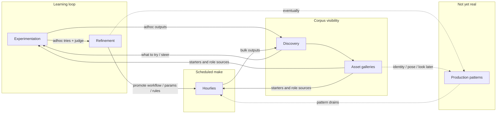

# Planning hub — operator activities

This directory is the **live** planning set. Detailed historical specs live under
[`archive/`](archive/) — see [`archive/MAP.md`](archive/MAP.md) for current ↔
archive mapping and conflict notes.

**Browse:** `./scripts/serve_planning_docs.sh` → [http://127.0.0.1:8000](http://127.0.0.1:8000)

| Mode | What you do |
|------|-------------|
| **Explore** | Follow curiosity; park notes in a live plan or archive MAP orphans. |
| **Corral** | Assign repeats to **one program** and **one live parent**. |
| **Execute** | At most one primary spike + one learning/maintenance lane. |

**Personal north star:** human-led corpus; classical search for daily discovery;
batch AI for analysis/tagging. Vision evidence:
[`archive/DISCOVERY_SEARCH_AND_SIMILARITY_VISION.md`](archive/DISCOVERY_SEARCH_AND_SIMILARITY_VISION.md),
[`archive/HEURISTIC_ENGINE_NORTH_STAR.md`](archive/HEURISTIC_ENGINE_NORTH_STAR.md).

---

## Worldview

- **Hourlies** — scheduled **manifestation** of promoted rules (not a separate program).
- **Adhoc** — how you try new things and learn what hourlies need.
- **Discovery** — make generated work visible and judgeable (Library + galleries).
- **Experimentation** — create/guide adhoc; steer; pick starters from galleries.
- **Refinement** — tune workflows, params, hourly policy; promote winners.
- **Production** — multi-stage patterns; intent only until drains are data-driven.

“Dailies” in conversation = **Hourlies** unless a true daily tier is split later.

**Starter** is a **role**, not a file type — see [`asset-gallery.md`](asset-gallery.md).

---

## Programs

| ID | Intent | Live plan |
|----|--------|-----------|
| **A1 Discovery** | See / search / lineage / judge; galleries as role sources | [`a1-discovery.md`](a1-discovery.md) |
| **A2 Experimentation** | Adhoc create + steer; pick starters | [`a2-experimentation.md`](a2-experimentation.md) |
| **A3 Refinement** | Promote technique into hourly + adhoc defaults | [`a3-refinement.md`](a3-refinement.md) |
| **A4 Production** | Patterned multi-step workproduct movement | [`a4-production.md`](a4-production.md) |
| **S1 Custody** | Files and refs stay true | [`s1-custody.md`](s1-custody.md) |
| **S2 Platform** | Run the machine | [`s2-platform.md`](s2-platform.md) |

Hourlies = manifestation of **A3** (+ eventual **A4**), fed by **A2**, observed in
**A1**, seeded from galleries. Primary Next slice:
[`a3-hourly-drain-policy.md`](a3-hourly-drain-policy.md).

### Old P1–P9 → new IDs

| Old | New |
|-----|-----|
| P1 Discovery & similarity | A1 |
| P2 Lineage & provenance | A1 (+ S1 for broken refs) |
| P3 Experiment pipeline & queue | Hourly under A3 / A2 steer |
| P4 Generation UX | A2 |
| P5 Orchestration | A4 |
| P6 Workflow corpus & recipe | A3 |
| P7 Media QA | S1 / S2 (on demand) |
| P8 Image content sorter / stills | A1 gallery + A3 tag drains |
| P9 Platform | S2 |

---

## Canonical parents (conflict rules)

1. **One parent per theme.** Children add slices only; parent wins on policy.
2. **Hourly** — parent [`a3-refinement.md`](a3-refinement.md). U1/U5 vehicle:
   [`a3-hourly-drain-policy.md`](a3-hourly-drain-policy.md). Steer *marks* under A2;
   hourly *consumes* them — no second scheduler. Detail conflicts: [`archive/MAP.md`](archive/MAP.md).
3. **Custody** — [`s1-custody.md`](s1-custody.md).
4. **Judgment** — [`judgment.md`](judgment.md) + root product models
   [`DISPOSITION_BUCKET_MODEL.md`](../DISPOSITION_BUCKET_MODEL.md),
   [`CLIP_SELECTION_MODEL.md`](../CLIP_SELECTION_MODEL.md).
5. **Asset galleries** — [`asset-gallery.md`](asset-gallery.md).
6. **`.data/WORKFLOW_FACTORY_NEXT.md`** — ops crumbs only; architecture here.

---

## Suggested focus (now)

| Slot | Activity | Action |
|------|----------|--------|
| **Primary** | A3 / Hourly | Drain policy as data + steer consumption |
| **Learning** | A2 | Adhoc + backlog steer; starters from galleries |
| **Visibility** | A1 | Discovery healthy; gallery language general |
| **Parked** | A4 | Capture patterns only; no runner yet |

---

## Doc index

| Topic | Document |
|-------|----------|
| This hub | **this file** |
| Archive map / conflicts | [`archive/MAP.md`](archive/MAP.md) |
| Asset galleries | [`asset-gallery.md`](asset-gallery.md) |
| Judgment | [`judgment.md`](judgment.md) |
| Hourly drains (Next) | [`a3-hourly-drain-policy.md`](a3-hourly-drain-policy.md) |
| Factory session crumbs | [`.data/WORKFLOW_FACTORY_NEXT.md`](../../.data/WORKFLOW_FACTORY_NEXT.md) |

Root stubs under `docs/*.md` point here and into `archive/` for old paths.

---

*Living file: after each spike, update Today / Next only for affected programs.*
