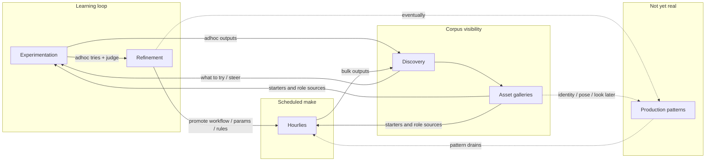

> **Archived draft** — see [MAP.md](MAP.md) and live docs under [`docs/plans/`](../). Do not treat this file as current authority.

# Planning overview — operator activities

This document is the **map** for design notes and delivery plans. Detailed
specs stay in child docs; this file sets **authority**, **programs**, and
**what to work on next**.

**Browse:** `./scripts/serve_planning_docs.sh` → [http://127.0.0.1:8000](http://127.0.0.1:8000)

| Mode | What you do |
|------|-------------|
| **Explore** | Follow curiosity; park notes here or in a child plan. |
| **Corral** | When something repeats, assign it to **one program** and **one parent doc**. |
| **Execute** | At most one primary spike + one learning/maintenance lane. |

**Personal north star:** human-led corpus; classical search for daily discovery;
batch AI for analysis/tagging. See [`DISCOVERY_SEARCH_AND_SIMILARITY_VISION.md`](./DISCOVERY_SEARCH_AND_SIMILARITY_VISION.md)
and [`HEURISTIC_ENGINE_NORTH_STAR.md`](./HEURISTIC_ENGINE_NORTH_STAR.md).

---

## Worldview

- **Hourlies** — scheduled **manifestation** of promoted rules, drains, seeds,
  clip honesty, and steer gates. Not a separate program.
- **Adhoc** — how you try new things and learn what hourlies need.
- **Discovery** — make generated work (hourly + adhoc) visible and judgeable,
  via Library and **asset galleries**.
- **Experimentation** — create/guide adhoc; steer what hourlies attempt; pick
  **starters** from galleries.
- **Refinement** — tune workflows, run params, and hourly policy; promote winners.
- **Production** — multi-stage workproduct patterns (e.g. Starter → Extend →
  Climax → Denouement). Intent only; orchestration not implemented.

“Dailies” in conversation = **Hourlies** (scheduled factory fill) unless a
true daily tier is split later.

### Asset galleries and starter roles

The **stills gallery** was the first concrete **asset gallery**, not a privileged
asset class. Same class includes clips, starter videos (no still), any
workproduct treated as a starter, and later specialty sources (identity, pose,
look for VACE, etc.).

**Starter** is a **role**, not a file type. See [`ASSET_GALLERY_MODEL.md`](./ASSET_GALLERY_MODEL.md).

---

## Programs

| ID | Intent | Today (short) |
|----|--------|---------------|
| **A1 Discovery** | See / search / lineage / judge; asset galleries as role sources | Library, lineage UI, ratings/disposition, still gallery (first specialization), clips |
| **A2 Experimentation** | Adhoc create + steer scheduled work; pick starters | Workbench, Submit, chain steer, backlog cards, remove/retire |
| **A3 Refinement** | Promote technique into hourly + adhoc defaults | Shape factory, repair, run-spec, hourly utility + drain policy |
| **A4 Production** | Patterned multi-step workproduct movement | Stub only — [`PRODUCTION_PATTERNS_PLAN.md`](./PRODUCTION_PATTERNS_PLAN.md) |
| **S1 Custody** | Files and refs stay true | Registry Ph0–1; pool prune-missing; locate/remediation designed |
| **S2 Platform** | Run the machine | Docker / WSL / GPU / check-in |

Hourlies = runtime manifestation of **A3** (+ eventual **A4**), fed by **A2**,
observed in **A1**, seeded from galleries.

### Old P1–P9 → new IDs

| Old | New |
|-----|-----|
| P1 Discovery & similarity | A1 |
| P2 Lineage & provenance | A1 (+ S1 for broken refs) |
| P3 Experiment pipeline & queue | Hourly under A3 ops / A2 steer |
| P4 Generation UX | A2 |
| P5 Orchestration | A4 |
| P6 Workflow corpus & recipe | A3 |
| P7 Media QA | S1 / S2 (on demand) |
| P8 Image content sorter / stills | A1 gallery specialization + A3 tag drains |
| P9 Platform | S2 |

---

## Canonical parents (conflict rules)

1. **One parent per theme.** Children add slices only; parent wins on policy.
2. **Hourly** — parent [`HOURLY_UTILITY_PLAN.md`](./HOURLY_UTILITY_PLAN.md).
   Children: [`HOURLY_GUIDE_PIPELINE_PLAN.md`](./HOURLY_GUIDE_PIPELINE_PLAN.md)
   (pipes/bins), [`HOURLY_DRAIN_POLICY_PLAN.md`](./HOURLY_DRAIN_POLICY_PLAN.md)
   (**U1/U5 design vehicle** for declarative drains). Steer *marks* live in
   [`CHAIN_STEER_AND_APPETITE_CONTROL_PLAN.md`](./CHAIN_STEER_AND_APPETITE_CONTROL_PLAN.md);
   hourly *consumption* of marks is specified under utility/drain — no second scheduler.
3. **Custody** — parent [`ASSET_LIFECYCLE_PLAN.md`](./ASSET_LIFECYCLE_PLAN.md).
   Children: lineage remediation, appetite-remove, output-path mitigation.
4. **Judgment** — [`RATINGS_V1_PLAN.md`](./RATINGS_V1_PLAN.md) +
   [`DISPOSITION_BUCKET_MODEL.md`](./DISPOSITION_BUCKET_MODEL.md).
   Appetite-similarity is later A3 refinement, not a parallel rating system.
5. **Asset galleries** — parent [`ASSET_GALLERY_MODEL.md`](./ASSET_GALLERY_MODEL.md).
   Children: still gallery hub, clip selection model, future specialty galleries.
   Auto-tagger / index-hour are tagging drains for a specialization (A3/S2).
6. **`.data/WORKFLOW_FACTORY_NEXT.md`** — ops checklist / session crumbs only;
   architecture lives in A3 parents.

---

## Suggested focus (now)

| Slot | Activity | Action |
|------|----------|--------|
| **Primary** | A3 / Hourly manifestation | Drain policy as data + steer consumption |
| **Learning** | A2 | Adhoc + backlog steer; starters from galleries; feed Refinement |
| **Visibility** | A1 | Discovery healthy; gallery language general; stills remain the concrete UI |
| **Parked** | A4 | Capture Production patterns + role slots; no runner until drains are data-driven |

---

## Doc index

| Topic | Document |
|-------|----------|
| This hub | **this file** |
| Asset galleries / starter roles | [`ASSET_GALLERY_MODEL.md`](./ASSET_GALLERY_MODEL.md) |
| Production patterns (stub) | [`PRODUCTION_PATTERNS_PLAN.md`](./PRODUCTION_PATTERNS_PLAN.md) |
| Hourly ruleset | [`HOURLY_UTILITY_PLAN.md`](./HOURLY_UTILITY_PLAN.md) |
| Hourly drains as data | [`HOURLY_DRAIN_POLICY_PLAN.md`](./HOURLY_DRAIN_POLICY_PLAN.md) |
| Guide pipes / bins / steer slices | [`HOURLY_GUIDE_PIPELINE_PLAN.md`](./HOURLY_GUIDE_PIPELINE_PLAN.md) |
| Chain steer & appetite | [`CHAIN_STEER_AND_APPETITE_CONTROL_PLAN.md`](./CHAIN_STEER_AND_APPETITE_CONTROL_PLAN.md) |
| Custody / locate | [`ASSET_LIFECYCLE_PLAN.md`](./ASSET_LIFECYCLE_PLAN.md) |
| Broken lineage | [`LINEAGE_REMEDIATION_PLAN.md`](./LINEAGE_REMEDIATION_PLAN.md) |
| Still gallery (specialization) | [`STILL_GALLERY_HUB_PLAN.md`](./STILL_GALLERY_HUB_PLAN.md) |
| Clips | [`CLIP_SELECTION_MODEL.md`](./CLIP_SELECTION_MODEL.md) |
| Ratings / disposition | [`RATINGS_V1_PLAN.md`](./RATINGS_V1_PLAN.md), [`DISPOSITION_BUCKET_MODEL.md`](./DISPOSITION_BUCKET_MODEL.md) |
| Heuristic north star | [`HEURISTIC_ENGINE_NORTH_STAR.md`](./HEURISTIC_ENGINE_NORTH_STAR.md) |
| Factory session crumbs | [`.data/WORKFLOW_FACTORY_NEXT.md`](../.data/WORKFLOW_FACTORY_NEXT.md) |
| Historical infra handoff | [`CURRENT_GOAL.md`](./CURRENT_GOAL.md) |

---

*Living file: after each spike, update Today / Next only for affected programs.*
